# CONTEXT — 共享設計脈絡（Design Context）

> 定位：本檔是 **PRD 與 ARCHITECTURE 共用的設計脈絡基底**（dev_model.md 的「③ 規格與決策基底＝脊椎」）。
> 收斂四類內容：①領域知識/既有系統　②設計決策＋取捨理由（ADR 風格）　③外部標準/參考　④視覺/結構設計。
>
> **與其他文件的分工（避免重複）**：
> - `PRD.md` = WHAT（需求/概念）；`ARCHITECTURE.md` = HOW（技術落地）；二者都**引用**本檔，不重述。
> - 本檔放**耐久的 why / 領域事實 / 標準依據 / 已拍板決策的理由**。
> - `DECISIONS.md` 放**未決 / 進行中追蹤（open / blocking-open）**——易變的留那裡，本檔只放已收斂的。
>
> 標籤沿用體系：`[decided]` / `[open]` / `[constraint]` / `[blocking-open]`。
> 路徑提醒：本檔在 repo **root**；全套 doc 結構（root + `docs/` 子目錄）見 `README.md` 文件地圖。

---

## 1. 領域知識 / 既有系統（Domain & As-Is）

> 目的：讓寫 ARCHITECTURE 的人不必逆向猜既有系統。PRD §8 給了概念模型就說「詳見 ARCHITECTURE」——
> 本節補那段缺口。**標 `[待你補充]` 的是只有 domain owner 有、我無法捏造的事實。**

### 1.1 既有 Parser 真實模型（兩階段、schema-agnostic）

```
RawBody (SML/XML/binary)
   │  ① 遞迴 parse（靠 SML format code，不需 schema）
   ▼
AST「地形」(tree)  ── 純結構樹，syntactic，無語意
   │  ② parseFItem 沿 flat schema「地圖」(offset + next_level) 走，在 AST 取值、貼 item name
   ▼
帶語意的解讀結果
```

- **痛點根源** `[constraint]`：用 **flat 地圖（offset）描述本質為 tree 的地形** → 巢狀難表達、offset 脆弱、不可驗證、改了沒人知道壞。
- **目標**：SSOT 改成**同構於 AST 的 tree（YAML）**，flat CSV 降為 compiler 衍生輸出，**parser 不動**，offset 變衍生值。
- **既有 schema 來源**：operator 用 **Excel 逐列標注**（SML 值 / item name / length），轉成 offset-based flat CSV 當地圖。線性逐列標注習慣**不可破壞**（結構由系統從 AST 補）。

### 1.2 SML / SECS-II 型別地基（SEMI E5）— S7F26 carrier

> S7F26 是 formatted recipe 的 **input carrier**（不是 schema，見 §2 guardrail 3）。其 body 的型別系統即 AST 與 schema 的型別地基。

**Item Format Codes**（來源：domain owner 提供；對齊 SEMI E5）：

| 類別 | 型別 |
|------|------|
| 結構 | **LIST**（巢狀容器，AST 的分支節點來源） |
| 二進位/邏輯 | **Binary**、**Boolean** |
| 字串 | **ASCII**、**JIS-8**、**2-byte chars** |
| 無號整數 | **1 / 2 / 4 / 8 byte unsigned int** |
| 有號整數 | **1 / 2 / 4 / 8 byte signed int** |
| 浮點 | **4 / 8 byte float** |

- **LIST** 是 AST 從 flat 變 tree 的關鍵：list 的巢狀深度就是「地形」的高度，現行 flat 地圖靠 `next_level` 隱式重建這個深度——這正是脆弱來源。
- **PPARM**：process program parameter（recipe 參數項）。`[待你補充]` — PPARM 在 body 中的實際承載結構、與 LIST/item 的對應關係、是否有固定 header。
- `[待你補充][open]`：各 format code 的**確切 octal/byte 值**（避免在此放可能錯的數字，待核對 SEMI E5 原文或既有 parser source）。strict 模式要「強制對齊 E5 型別系統」，需要這張精確對照表。

### 1.3 需要 domain owner 補的事實 `[待你補充]`

- [ ] 一份**真實 SML 範例**（formatted recipe body，去敏後）— 寫 data-flow 與測試 fixture 的地基。
- [ ] 對應的**現行 Excel→CSV 地圖範例**（同一支 recipe）— 黃金回歸測試（逐 byte 一致）的 baseline。
- [ ] `parseFItem` 的**對齊邏輯**（offset / next_level 怎麼沿 AST 走）— compiler 要產出與它相容的 flat。
- [ ] PPARM / S7F26 body 的實際 layout（見 §1.2）。
- [ ] 既有提交工具「**模擬正確性**」實際驗什麼（PRD §11#4 待調查）。

### 1.4 既有 Flat Schema Map 契約（OFFSET / NEXT_LEVEL / NextRef）= Compiler 規格

> 來源：domain owner 逆向既有 parser（`parseFItem` / `parseBItem`）。**這是 compiler 的目標規格**：
> tree SSOT 編譯出的 flat map 必須產出與此語意一致的欄位（黃金測試逐 byte 鎖死）。

**Schema 列欄位**（至少）：`name, OFFSET, NEXT_LEVEL, NextRef, length, type`。

**OFFSET — 同一欄、兩套語意** `[decided]`：
- **格式化路徑（parseFItem）**：`sItem.GetItem(OFFSET)` → **1-based child index**，進 parent SECS List 挑出 child AST node。
- **二進位路徑（parseBItem）**：`Bindex + OFFSET + j*intrLength` → **0-based byte offset**，進 flat bytes array（不是 index）。

**NEXT_LEVEL — 分派表（dispatch enum）** `[decided]`：決定下一層用哪個演算法處理。

| NEXT_LEVEL | 路徑 | OFFSET 用途 | 演算法 |
|---|---|---|---|
| **C** | F | 定位 CCode list | 遍歷 2-element sub-entries → NextRef `Like` 匹配 → clone 對應 schema；子參掛 **ListParam** |
| **NC** | F | 定位 CCode list | 同 C，但子參掛 **CCodeNodeParam** |
| **TC** | F | NextRef=index | 讀 tag → 匹配 schema Tag 欄 |
| **L** | F | **不用** | 遍歷父 list **全部 children**，每個 clone **同一** child schema（= 同名可變陣列）|
| **GF** | F | 定位 sub-list container | 遍歷其 children，各 clone schema |
| **PVL** | F | 定位 tag-value list | tag-value pair → Tag 匹配（NextRef=逗號分隔 index）|
| **CPL** | F | 定位 tag-value list | tag → 匹配 schema Tag 欄；NextRef=index |
| **DCPL** | F | 定位 list | 像 PVL/CPL，但**動態建參、不預查 schema** |
| **TP** | B | NextRef/Offset 指定位置 | 動態，從 index 讀 key+value |
| **B** | F→B | 定位 SECS-B child | 取 DataValue bytes → **跳 parseBItem**（格式→二進位轉換）|
| **I** | B | byte offset | NextRef → count、length bytes/record |
| **G** | B | byte offset | count 從 NextRef 或 remaining bytes |
| **IT** | B | byte offset | 讀 tag、匹配 NextRef |
| **NF / N** | F/B | 定位值 | 葉節點，直接讀值（終止）|

**Compiler 映射規則** `[decided]`（tree node → flat 欄位）：
- 同名 sibling 群 → `NEXT_LEVEL=L`（OFFSET 省略）。
- 異名固定結構 → 位置型 dispatch（C/NC/GF/PVL/TC/DCPL 擇一）+ `OFFSET = 1-based child index`。
- 內嵌 SECS-B 區塊 → `NEXT_LEVEL=B`，下游節點改用二進位語意（OFFSET 變 byte offset）。
- 葉 → `NF/N`。

#### 1.4.1 AST 形狀簽名 → dispatch 推斷（schema-abstractor 規格）`[decided]`

> 樞紐結論：dispatch **部分可從 AST 形狀推斷**；不可推的是「形狀碰撞」家族，需 user/protocol 補語意。
> 架構是 **hybrid：Converter 推候選 → user 定案**。這給 PRD §8.1 ambiguity 模型程式級依據。

**可自動推斷（Converter 從 AST 做）**：
- `B` ← child DataType == SECS_B（唯一）
- `NF/N` ← 無 children、leaf scalar（isList==false）
- `L` ← homogeneous list（全 children 同結構；須 heuristic）
- `I/G` ← binary fixed-record（從 length 推）

**條件推斷**：
- `GF` ← 嵌套 list 但 OFFSET>1（非遍歷全部）
- `TC` ← 第一個 element 是 ascii tag、後續以 tag 路由

**必然歧異 — 形狀碰撞** `[constraint]`：`C / NC / CPL / DCPL / PVL` 在 AST 層**完全同形** = `L[N]{ L[2] }`。
AST 只看到 `<A 'xxx'><value>`，**無法判斷 xxx 是 CCODE 還是 TAG**。區分需 domain 知識或 protocol PDF：

| dispatch | child[1] 語意 | child[2] 語意 | NextRef |
|---|---|---|---|
| C | CCODE（`Like` pattern 匹配）| payload（遞迴解析）| pattern |
| NC | CCODE（`Like` pattern 匹配）| payload（flat 加入）| pattern |
| CPL | TAG（匹配 schema Tag 欄）| scalar | index |
| DCPL | TAG（動態）| scalar | index/空 |
| PVL | TAG（匹配 schema Tag）| scalar | 逗號分隔 index |

**user / protocol profile 必須補的資訊（非 NEXT_LEVEL 本身）**：
- C/NC → NextRef = like pattern（如 `"101"`, `"10*"`）
- CPL/PVL → Tag 欄 = 每個參數對應的 tag name
- TC → NextRef = tag 所在 index
- GF → OFFSET = sub-list 位置

**結論** `[decided]`：`L[N]{L[2]}` 有五種語意解釋，只有 domain 知識／spec PDF 的 protocol definition 能區分。
**schema-abstractor 把 dispatch 推到候選列表，最終選擇由 user 指定** → 正是 PRD §8.1「convention 推、歧義 warn、user override」的程式級實證。

**實務上 disambiguation 的來源（= shift-left 邊界）** `[decided]`：

| 資訊 | 來源 | 需 PDF？ |
|------|------|---------|
| CCODE 值 | SML 數據可見（系統讀）| 否 |
| CCODE 名字 | user URD CSV 第 2 欄（engineer 本來就標）| 否 |
| like-pattern | 系統可導（多個 ccode 共享同一子結構 → 用 pattern）| 否 |
| C vs NC | 慣例：NC 只是輸出樹扁平化 → 預設 C | 否 |
| CPL/DCPL/PVL/TC 的 TAG 映射 | spec PDF / protocol definition | **是**（但這類 mode 現在很少用）|

> **Authoring 成本模型 / shift-left 邊界** `[decided]`：**主流路徑（C/NC/L/GF/B/NF）完全靠 AST + 3 欄 URD + 系統 heuristic 解出 ——
> 零 PDF、零協定專家 → shift-left 對 MVP（formatted 主流）完整成立。** 只有罕用的 TAG-based
> （CPL/DCPL/PVL/TC）需查 PDF；MVP 可標 fallback / 暫不支援。

**仍待釐清的 schema 設計約束** `[open]`：
1. **OFFSET 雙語意**：compiler 須知節點落在格式化或二進位路徑，emit 對應語意；tree schema node 需帶「路徑/編碼」標記。
2. **B 是格式↔二進位轉換點**：recipe 可能是「格式化外殼 + 二進位孤島」混合樹 → §1.5 Ingest 的 formatted/binary 三分法非乾淨互斥；compiler 須在 B 節點切換模式。
3. ~~**DCPL/TP 不預查 schema、動態建參**~~ → **`[decided]` D18：禁 dynamic parsing**。tree SSOT 維持 closed-world，不加 open/dynamic 節點型別；含 DCPL/TP 的 recipe MVP 不支援。
4. ~~**罕用 TAG-based 尾巴**~~ → **`[decided]` D19：MVP 不支援 CPL/PVL/TC**（連同 D18 使碰撞家族塌成 C/NC）。future 重用時 per-tool-model dispatch profile 住哪（package 內嵌 vs schema-family 模板庫）+ ParserRegistry metadata key 仍 `[open]`（見 DECISIONS）。

### 1.5 Legacy Runtime Parsing Flow（as-is，with modules）

> 來源：domain owner 提供。**這是既有系統的 runtime 解讀流（as-is），不是 onboarding flow。**
> 此流跑的時候 **Schema 已經存在**（早已 onboard 完成）——機台送 recipe 進來，parser 依既有
> flat 地圖解讀。補上了真實傳輸載體（Edge Server → base64 → SECS-II ByteArray）與
> **Binary Preprocessor** 模組名。
>
> **與本系統的關係**：本 onboarding 系統**不改這條鏈**（PRD「parser 不動」的具體所指）；
> 它在**另一條 authoring 流**裡產生這條鏈消費的 Schema/CSV 地圖（見 §1.6）。

```mermaid
%%{init: {'theme':'base','themeVariables':{'fontFamily':'-apple-system, Segoe UI, Helvetica, Arial, sans-serif','fontSize':'14px','lineColor':'#9aa5b1','primaryTextColor':'#2d3748'},'flowchart':{'curve':'basis','nodeSpacing':45,'rankSpacing':55}}%%
flowchart LR
    TOOL(["Tool 機台"]):::ext
    EDGE(["Edge Server"]):::ext
    AAA["AAA 接收<br/>base64 → ByteArray (SECS-II)"]:::sys
    DETECT{"需要 Binary<br/>Preprocessor?"}:::decision
    PRE["Binary Preprocessor<br/>賦予結構 → 可進 tree 的中繼產物"]:::sys
    PARSER["Recipe Body Parser<br/>① 遍歷 body 成 AST（地形, schema-agnostic）<br/>② 依既有 flat 地圖(CSV/offset) 從 AST 解出 representation"]:::sys

    TOOL ==>|recipe body| EDGE
    EDGE ==>|base64 string| AAA
    AAA ==> DETECT
    DETECT -.->|yes · 非自描述 / binary| PRE
    PRE ==> PARSER
    DETECT ==>|no · formatted / XML 自描述| PARSER

    classDef ext fill:#eef0f2,stroke:#aab2bd,color:#5a6470,stroke-dasharray:5 4;
    classDef sys fill:#e3edf9,stroke:#5b8fd6,stroke-width:2px,color:#1f3a5f,rx:8,ry:8;
    classDef decision fill:#fdecd8,stroke:#e0993e,stroke-width:2px,color:#6b4514;
    linkStyle 0,1,2,4,5 stroke:#5b8fd6,stroke-width:2.5px;
    linkStyle 3 stroke:#c97b7b,stroke-width:2px,stroke-dasharray:5 4;
```



**模組鏈 + 能力分層對應**（縫合 HYPER_SPEC Layer 視角）：

| 模組 | 職責 | 能力分層 | Owner |
|------|------|---------|-------|
| **Tool 機台** | 產出 recipe body | Layer 0 | Equipment（環境）|
| **Edge Server** | 傳輸、base64 編碼 | Layer 0 | BB（邊界外）|
| **AAA 接收** | 收 base64 → ByteArray（SECS-II carrier）| Layer 0→1 邊界 | AAA |
| **Detect** | 判斷自描述與否（formatted/XML vs binary）| Layer 1 Recipe Body Format | AAA／本系統 |
| **Binary Preprocessor** | 非自描述 binary「賦予結構」→ 中繼產物（= PRD §8.1 preparser 中繼）| Layer 1→2 | 本系統（future，MVP 不實作）|
| **Recipe Body Parser** | ①遍歷成 AST（schema-agnostic）②依 Schema 解出 representation | Layer 2→3（用 Layer 4 Schema）| 既有 VB parser（wrap adapter）|

**對齊既有模型**：本鏈的 Parser ①② 即 §1.1 的兩階段；①遍歷成 AST 不需 schema、②才用既有 flat 地圖。`Detect` 即 PRD §5.2 的「格式軸」分流；`Binary Preprocessor` 即 PRD §8.1「preparser 中繼」。

**兩條流的關係（關鍵心智模型）** `[decided]`：

```
Onboarding authoring flow（本系統 · 新）          Legacy runtime parsing flow（§1.5 · as-is · 不動）
  單一 sample → 標注 → Schema(YAML tree)              機台送 recipe → ① AST → ② 依地圖解讀
                          │  compile（衍生）                              ▲
                          └────────► flat 地圖(CSV) ───────────────────────┘
                                     （新 authoring 產出，餵給舊 runtime）
```

- runtime 時 **schema 已存在**，無「雞生蛋」；schema 是 onboarding flow 的**產出**，不是 runtime 的輸入待解。
- **「parser 不動」= §1.5 這條 legacy runtime 鏈原封不動**；本系統只換掉 schema/CSV 地圖的**製作方式**（從 operator 手刻 Excel → tree SSOT 編譯衍生）。

**仍待釐清** `[open]`：

- **onboarding flow 怎麼取得 sample RawBody？** 是復用 §1.5 同一條 ingestion 路徑(Tool→Edge→AAA)落地一份 RawBody,還是 user 手動 import 一個 sample 檔(PRD Layer 0「Manual Import」)? RawBody 一等物件的擷取/固化點(含 checksum)請確認。
- **`Detect` 的判斷依據**:靠 metadata(bodyFormat/toolModel)還是 sniff body? 牽動 ParserRegistry metadata 契約(blocking-open)。
- **onboarding 期要不要、能不能跑 §1.5 的 Parser?** 例:user 標注前,是否先用既有 parser ① 把 sample 遍歷成 AST 給 user 看(PRD US-1.2「檢視 recipe 結構」)? 若是,則 onboarding 復用 Parser ①(產 AST),但 ② 由新的 authoring/binding 取代。`[待你確認/grill]`
- **Runtime 行為契約**(= Runtime Parser Behavior Spec,**P1 去風險;安全性壓在此,須逆向/實測,非猜**)`[blocking-open]`:legacy runtime 撞到非預期時怎麼反應? ① **schema-miss/未涵蓋結構 → fail-loud or silent-wrong?**(最關鍵)② type mismatch ③ missing required ④ extra/unmapped ⑤ count mismatch ⑥ out-of-range(runtime 驗不驗?)⑦ binary path 差異。→ 列 M1 spike 待查(同級『VB① 能否乾淨回樹』);擋 strict 安全性論證(`DECISIONS BO-4`)。

### 1.6 Onboarding Authoring Flow（新 · 本系統核心）`[decided 大方向]`

> 本系統實際要蓋的流（對比 §1.5 legacy runtime）：單一 sample → engineer 線性標 URD → schema-abstractor 推 dispatch（主流自動、罕用 TAG-based 升 PDF）→ tree SSOT →（compile→CSV 餵 §1.5 legacy）+（project→檢視/驗證）→ package。它**產生** §1.5 runtime 消費的 Schema/CSV。
>
> **工程細節不在本檔（HOW 屬 ARCHITECTURE，避免重複漂移）**：pipeline ①–⑩ 見 `ARCHITECTURE §2`、文件物件流 見 `§2.2`、對折星型（模組依賴）見 `§4.2`、deep module 操作契約 見 `§4.3`、**模組×功能 catalog（簽名/能力層）見 `§4.1`、擴充點 見 `§4.4`**。
> 兩條流的關係（誰產誰耗）見 §1.5；dispatch 成本模型（主流零 PDF vs 罕用 TAG-based 需 PDF）見 §1.4.1。本節只留下面這條**此流專屬、別處不重複**的 open。

**AST 取得機制 α / β / γ** `[deferred→M1 spike]`（配 §2 D14 / `ARCHITECTURE §10`）：
- D1a 已證 parser ① 可 map-free 分離；**機制選型在 M1 spike（F1.1/F1.2）決定**，invariant 已鎖（AST 與 legacy ① 同構、黃金測試逐 byte 對齊）。
- **γ＝自建 β 出貨 + VB ① 當 oracle** 為領先候選。Spike 待答事實：① VB ① 能否乾淨叫出、只拿樹；② authoring stack。
- 其餘 open（sample RawBody 擷取點、OFFSET 雙語意 + B 混合樹）見 §1.5 / §1.4.1。

### 1.7 Metadata 三層 Data Model `[decided 分層；部分欄位 open]`

> 核心原則（對齊 AAA Standard Risk 6 / PRD §8）：**RawBody = 原始不可變輸入；
> parser / abstractor / compiler / schema 版本 = 解讀脈絡。** 依「可變性 + 來源」分三層，
> 不可把「後來如何被解讀／衍生」的欄位塞進 RawBody。

| 層 | 名稱（性質） | 何時定、可變嗎 | 欄位 |
|----|------|------|------|
| **A** | RawBody intrinsic（擷取期）| ingest 時定，**永不變** | bodyId, bodyFormat, encoding, rawBodyReference, checksum, size, source, sourceTime, sourceSystem, **toolModel（機台原報）**, ppid（+ captureAdapterVersion / ingestionVersion 若 adapter 正規化）|
| **B** | Interpretation context（解讀／衍生期）| 每次 re-parse / re-abstract / re-compile **可重新衍生** | (legacy)parserVersion ／(β)structuralParserVersion、abstractorVersion、compilerVersion、schemaVersion、projectionVersion、generatedTime、dispatchProvenanceSummary（auto/override/PDF 計數）、csvDerivedFromSchemaHash |
| **C** | Submission context（提交期）| package / gate 時定 | 〔ParserRegistry 契約組〕bodyFormat, toolType, **toolModel（canonical）**, recipeType, schemaVersion, vendorFormatVersion, parserHint, strict/compatMode, sourceSystem, ppid, rawBodyChecksum ＋ gateResult, submitter, approvalTime, packageChecksum |

**物件 → 層**：RawBody=A；AST / Schema(SSOT) / CSV / Canonical Projection=B（各帶自己的衍生版本）；Package=C（綁 A 的 checksum + B 的版本 + 治理結果）。

**grill 結論（boundary cases）**：
- **toolModel 出現在 A 與 C 不是重複** `[decided]`：A = 機台原報（不可變、audit 用）；C = 校正後 canonical（供 ParserRegistry 選 parser）。user 校正**不回寫 A**；ppid 同理。
- **schemaVersion 在 authoring 期是 draft** `[open]`：onboarding 正在「生」schema → Projection 記的 schemaVersion 為 provisional，**package 凍結才定版**。需定 draft↔frozen 版本語意（接 PRD §13「DB schema 版本管理」後期項）。
- **dispatch provenance 住 Schema tree node 內**（per-node：auto / user-override / PDF）；B 層只放**摘要**供 audit + IT gate 判斷人工介入多寡。
- **CSV 衍生綁定** `[decided]`：B 記 `csvDerivedFromSchemaHash + compilerVersion` → 支援 package validation 的 `PKG002_CSV_NOT_DERIVED_FROM_YAML` 重算驗證。
- **新增 B 層版本欄（本輪深挖補的）**：`structuralParserVersion`（若走 β）、`abstractorVersion`（dispatch 推斷邏輯會演進）、`compilerVersion`（offset 是衍生值，compiler 變則 CSV 變）——PRD §8 只列 parserVersion/schemaVersion/projectionVersion，這三個是同原則延伸。
- **C 層 = ParserRegistry blocking-open** `[blocking-open]`：C 的提交組正是 PRD §5 / HYPER_SPEC C.3 的 ParserRegistry metadata 契約 ＋ gate/submitter。**定清 C 層 = 推進該 blocking-open**，但確切欄位與既有 AAA 的對應仍 blocking。
- **MVP 取捨** `[open]`：B 層那三個衍生版本欄對單機台 MVP 可能 YAGNI；**分層 grouping 先立**（便宜、利 audit/升級），**欄位逐步充實**。

---

## 2. 設計決策 + 取捨理由（Decided + Rationale, ADR 風格）

> 只放**已拍板**的決策與其 why。未決的在 `DECISIONS.md`。每條：決策 → 理由 → 取捨/被否決的替代。

| # | 決策 `[decided]` | 理由（why） | 被否決的替代 / 取捨 |
|---|------|------|------|
| D1 | **SSOT = tree（同構於 AST，序列化成 YAML）**，CSV 是 compiler 衍生 | **tree ⊃ CSV**：CSV 只裝 runtime 導航（name/offset/next_level/nextRef/length/type），而 validation 約束 / provenance / 變異性意圖 / 完整結構（含 unused 節點）**只活在 tree** → CSV 是 **lossy 投影、當不了 SSOT**；且 offset 變 compiler 衍生、不再手維護（tree 描述 tree，巢狀可表達、可驗證、可版控）| 否決「**CSV 留 SSOT**」（lossy、offset 脆弱、改一處全位移）；否決「直接改 parser 吃 tree」（動 20 年 parser）→ 改寫 compiler、parser 不動 |
| D2 | **不動既有 VB parser，wrap adapter** | parser 運行二十年、抽換成本極高；用 thin wrapper 去風險 | 否決重寫 parser core |
| D3 | **雙模式 strict / compat + 單向升級閘門** | 新機台要嚴謹 E5；舊機台零成本永久支援；升級 = 走一次完整 strict onboard | 否決自動升維（會產生「半驗證的 compat tree」）|
| D4 | **MVP 聚焦 formatted**；target formatted+XML；unformatted 需 preparser 中繼=future | formatted 佔 80% 且是主痛點；binary preparser 每支 1~2 週、ROI 低（15%）→ 從源頭與 vendor nego | 否決現階段做 VB/Python 混合兼容 |
| D5 | **Semantic Binding 等級 2**（user 貼 name + 系統可覆寫預設）；機制細節 `[open]` | user 是 recipe 專家但不懂 machine schema；convention 表達意圖優於系統歸納 | — |
| D6 | **歧義不靜默猜**：convention 無法安全判定 → 發 ambiguity warning 要 user override | 單一 sample 無法推斷所有結構變異；歧義須顯式可稽核 | 否決系統靜默猜 schema 語意 |
| D7 | **單一 sample 前提**（不做多範例歸納） | 通常一個 tool 只拿得到一個 SML/XML 範例 `[constraint]` | 已知限制：缺「未出現分支」的風險（→ DECISIONS）|
| D8 | **RawBody 一等不可變物件** | parser/schema/vendor 格式都會變；保留原始 body 才能 re-parse/audit/升級/golden 重建 | 否決把 RawBody 當 attachment |
| D9 | **Canonical Recipe Projection ≠ AAA runtime canonical object** | 前者是 onboarding 期投影，提交後由 AAA 收斂成 runtime 物件；同一收斂鏈不同階段 | 否決把兩者當同義詞 |
| D10 | **package-centric**（不依賴線上中心 DB），檔案結構分 user 區 / IT 區 | 為流通；承載 user 輸出 + IT gate 結果雙方貢獻 | — |
| D11 | **Validation 與 Comparison 分離**（AAA Rule 7） | validation=這個 recipe 合不合法；comparison=兩 recipe 差異可否接受；comparison 在邊界外 | — |
| D12 | **Parser ① 可 map-free 分離出完整 typed AST** | 既有 ① 純靠 SECS-II header（6-bit type + 2-bit NLB）遞迴建整棵樹、含 unused 節點；② 才用 schema 導航（見 §1.4/§1.5）| 推翻「① 被 map 引導、無獨立 AST」的疑慮 → onboarding 看得到未 onboard recipe 全貌 |
| D13 | **dispatch 用 hybrid 推斷：Converter 推候選 + user 定案** | 主流（C/NC/L/GF/B/NF）靠 AST+3欄URD+heuristic 自動；only 罕用 TAG-based 需 PDF（見 §1.4.1）| 否決「user 須手選 8 種 dispatch」（破 shift-left）；shift-left 對 MVP 成立 |
| D14 | **AST 取得機制（α/β/γ）延後 M1 spike 決定；現鎖 invariant** `[deferred→M1]` | 選型取決於兩個只能實測的事實（VB ① 可否乾淨叫出、authoring stack），M1 spike（F1.1/F1.2）正是去風險載具，不應在 spike 前預判 | **不變 invariant**：取得的 AST 須與 legacy ① **同構**（offset 才對齊）、用黃金測試鎖；**γ（β 出貨 + VB ① 當 oracle）為領先候選**。否決「現在硬拍機制」|
| D15 | **metadata 依可變性分三層（A 不可變 / B 可重衍生 / C 提交期）** | RawBody=原始不可變輸入；parser/abstractor/compiler/schema 版本=解讀脈絡；ParserRegistry 契約=提交脈絡（見 §1.7）| 否決把「如何被解讀」的版本欄位塞進 RawBody |
| D16 | **schema-abstractor 結構保真：Schema 同構於 AST（只貼語意 + dispatch，不重整樹形）** | tree-SSOT（D1）+ offset 衍生 + 黃金測試 byte-identical（F1.2）全靠 abstractor 不動樹形——只在 AST 節點貼 name/dispatch/驗證屬性，不增刪／合併／重排節點，compiler 才能由樹深度優先位置重現 `parseFItem` 遍歷（見 `ARCHITECTURE §4.3` abstractor invariant）| 否決「abstractor 可正規化／攤平／重排樹」——放棄 authoring 期清理髒 AST 的能力，換 byte-identical 對齊 + 單一 SSOT |
| D17 | **SEMI E42 是 reference-only：E42 = 管理服務脈絡，本系統 = recipe payload schema 系統** | E42/E42.1 規範 recipe 管理行為／生命週期／訊息服務；本系統範圍是 payload 結構／schema 描述／validation／normalization(=projection)／vendor parsing。把 E42 當 schema 定義來源會混淆 carrier 與 schema（guardrail 3 / AAA Rule 2），並把邊界外的 AAA 服務拉進範圍 | 否決「實作 E42 AAA 服務」、「以 E42/E42.1 當 recipe body schema 定義」、「把 transport（HSMS/SECS-I）納入範圍」|
| D18 | **禁 dynamic parsing（DCPL/TP 動態、schema-less 節點）** | DCPL/TP 執行期不預查 schema、動態建參，破壞 tree SSOT 的 closed-world 前提（offset 由 compiler 純衍生、黃金測試逐 byte 鎖死，見 §1.4.1#3 / `ARCHITECTURE §3.3`）。明定禁止 → tree 維持可完全列舉、dispatch enum 砍掉 DCPL/TP、compiler 不需分岔靜態衍生 vs 動態建參。理由 = **降實作難度** | 否決「為 DCPL/TP 加 open/dynamic 節點型別」（換得 closed-world SSOT，代價=含此類節點的 recipe MVP 不支援）|
| D19 | **MVP 不支援 TAG-based 尾巴（CPL/PVL/TC）** | 形狀碰撞家族 `L[N]{L[2]}` 原為 5-way（C/NC/CPL/DCPL/PVL）；連同 D18 砍 DCPL，再砍 CPL/PVL/TC 後塌成 **C/NC**，且 C vs NC 有慣例預設 C（§1.4.1）→ 主流路徑零 PDF、純 AST+3欄URD+heuristic 解出。理由 = **消主流二義性 + 零 PDF shift-left** | 否決「MVP 支援罕用 TAG-based」（這類 mode 需 PDF/protocol profile、現已罕用，§1.4.1 結論）；保留 future 重用（§1.4 open#4）|
| D20 | **既有 CSV table format = 對外相容契約：序列化須 byte-identical** `[constraint]` | 舊 VB runtime 二十年都吃這支 flat CSV；不論內部 authoring 樹形如何，compiler 序列化出的 CSV 必與舊輸出逐 byte 一致，否則機台誤讀 recipe（黃金測試鎖死；配 D1 由 tree 獨力還原 CSV、offset 純衍生）| 否決「為 authoring／內部方便改 CSV table 格式」——對外契約不可動、內部樹形自由（相容性約束點在序列化層，不在內部表示）|
| D21 | **CSV 可逆當地圖：既有 CSV + RawBody 可 bootstrap 出骨架樹**（compat→strict 加速旁路）`[decided]` | 已 onboard 的 recipe 已存 CSV（flat 導航地圖）+ RawBody；升級不必每次從零走（甲＝RawBody 重走），可用 CSV 當地圖重 parse RawBody → 直接得骨架樹（結構＋型別＋值），user 只補差（變異性／約束／語意）→ YAML SSOT。是 D20（tree→CSV 序列化）的逆向；產出節點標 `provenance=csv-inferred` | 否決「compat→strict 僅 RawBody 重走單一路徑」；取捨：csv-inferred 推斷有風險（配 D7 單一 sample、風險正比規模 → 批次 migration 現階段不做，見 DECISIONS），bootstrap 是加速旁路、非取代 §2 主 pipeline |
| D22 | **URD ＝ user 提供的 serialized 輸入（sample RawBody ＋ 線性標注），由 `URD parser` 解析**：MVP 採「匯入」模型（Model B）——`URD parser` 把 RawBody parse 成 AST，並把 user 線性標注**按深度優先遍歷序綁回 AST 節點** → 衍生 binding 樹 → abstract → Schema SSOT。後期再加 UI inline 標注（Model A）。**用詞**：「URD-輸入」＝匯入的 serialized 物（sample＋標注）；「URD-樹」＝綁定後的記憶體樹 `[decided]` | 與 PRD 一致（PRD 早已「AST 從 URD parse 出」line 263）；**無需先做 UI**、保住 user **線性標注習慣不變**（README 目標）、對齊 manual import 輸入定義（§1 入料）；線性↔nested 對齊用遍歷序，正是 legacy flat-CSV/OFFSET 的同構作法 | 否決 Model A（先 parse 出 AST、再在 UI 上逐節點互動標注當唯一路徑）——MVP 不擋在 UI 上、且離線批次標注較合 user 習慣；代價：歧義解決變 **round-trip**（匯入→報歧義→改標注→重匯），inline 化留待後期 UI |

> 完整 [open] / [blocking-open] 追蹤（ParserRegistry metadata 契約、Submit skill 欄位對應、E172/E173、mixed run…）見 `DECISIONS.md`，本檔不複製。

> **D14 連動註記**（配 §1.6 α/β/γ open）：
> - **樹形狀釘死、內容豐富（≅ AST ⊃ CSV）**：Schema **同構於 AST**（≅ legacy① 結構，D16/D14）——**形狀不自由**。自由的是它**完整保留結構＋語意**（item name / validation / variability / provenance），是 CSV 的**超集**（D1：tree ⊃ CSV；CSV 只是 runtime 導航的 lossy 投影）。compiler 把 Schema 序列化成**既有 CSV table、與舊輸出逐 byte 一致**（黃金測試 / D20），**正因**樹的深度優先遍歷重現 `parseFItem`。
> - **務必分兩層**：方向（自建）是 D1 推論、已收斂；機制（α/β/γ 何者落地）仍取決於 D14 兩個實測事實，`[deferred→M1 spike]`，本註記不預判。

---

## 3. 外部標準 / 參考（External Standards & References）

### 3.1 SEMI 標準依據 `[constraint]`（來源：PRD §3.2）

| 標準 | 關係 | 立場 |
|------|------|------|
| **SEMI E5 (SECS-II)** | SML 型別系統（format code、巢狀規則）= AST 與 schema 的型別地基（見 §1.2） | **核心依據**（strict 強制對齊）|
| **SEMI E42 (AAA)** | recipe 管理行為、生命週期、SECS-II 訊息服務 | **定位對齊**：本系統做 authoring 角色，不實作其管理/訊息服務 |
| **SEMI E139 (RaP)** | PDE 的 XML schema / header-body 分離 | **概念借鏡**（標準 Inactive、採用度低，不採其 schema）|
| **SEMI E172 (SEDD)** | 設備資料字典，概念與本系統 schema 接近 | `[open]` 待評估適用性 |
| **SEMI E173 (SMN)** | SECS-II 的 XML 表示法 | `[open]` 待評估是否為 XML 輸入路徑依據 |

> **定位結論** `[decided]`（ADR D17）：**E42 defines the recipe management _service context_; this project defines the recipe _payload schema system_.** E42 / E42.1 是 recipe **管理服務**（生命週期、訊息服務）的**參考模型**，**不**作為 recipe body payload 的 schema 定義來源。
> **Transport（HSMS / SECS-I 連線、session handling）明確 out of scope** —— 位於認領層**之下**（`HYPER_SPEC A.1`）、owner 是 BB（`REFACTOR_STANDARD §3.1`）。本系統只取 SECS message **body 結構**以抽出 payload；**carrier ≠ schema**（guardrail 3 / AAA Rule 2）。
> 「**normalize**」在本系統 = 投影成 **Canonical Projection**（`project`），**≠** 重整 schema 樹形（D16 禁止 abstractor restructure）。

### 3.2 訊息 / 載體

- **S7F26** = formatted process program 的 input carrier（見 §1.2）。**carrier ≠ schema** `[constraint]`（guardrail 3）。
- `[待你補充]`：實際使用到的其他 SECS 訊息（S7F23/F24…？recipe 傳輸相關）。

### 3.3 方法論參考（how we work，非 domain）

> 來源：使用者提供的外部 skill 庫，作為協作/工程方法論借鏡（對齊 dev_model.md 的 self-contained pod）。

- **mattpocock/skills** — engineering skills：<https://github.com/mattpocock/skills/tree/main/skills/engineering>
- **mattpocock/skills** — productivity/handoff：<https://github.com/mattpocock/skills/tree/main/skills/productivity/handoff>
- **obra/superpowers**：<https://github.com/obra/superpowers>
- `[待確認]`：要採用其中哪些 skill 進本 repo 的 `.claude/`（還是只當參考）？

---

## 三條 Guardrail（最高約束）`[constraint]`

> 對齊 AAA Standard §9。ARCHITECTURE 與所有設計都不可違反。

1. **RawBody 一等不可變 domain object** — 原始 body + capture metadata，供 re-parse / audit / 升級 / 重建。
2. **Schema / Binding / Governance 分離** — Schema=長什麼樣；Binding=可用在哪（本系統做的是 **Semantic Binding** 標 name，非 Applicability Binding）；Governance=是否核准。
3. **通訊載體不是 schema** — S7F26 / formatted SECS-II / XML / vendor file 是 carrier，schema 須經 semantic binding 獨立定義。

---

## 4. 視覺 / 結構設計（Diagrams）

> 既有圖**不複製**，只指路；本檔放 ARCHITECTURE 需要、目前還缺的圖（用 Mermaid，**不用 `<b>/<i>/<small>` HTML 標籤**，強調靠 classDef）。

### 4.1 既有圖（引用，不重畫）

| 圖 | 位置 |
|----|------|
| 雙模式平行管線（strict/compat + 升級閘門）| `PRD.md` §4.1 |
| High-Level Flow（Flow 1/2/3 + reject 回圈）| `PRD.md` §7 |
| 物件概念關係（RawBody→AST→Projection；URD→Schema→CSV）| `PRD.md` §8 |
| 三條進 info model 路徑 | `PRD.md` §8.1 |
| 能力分層認領圖（Layer 0~5）| `HYPER_SPEC.md` §A.1 |
| 協作三層 / 四層共享基底 | `dev_model.md` |

### 4.2 待補的圖（ARCHITECTURE 主產出）`[open]`

- [x] **Legacy runtime 資料流（with modules）**：見 §1.5（Tool→Edge→AAA→Detect→Preprocessor/Parser，as-is）。
- [x] **Onboarding authoring 資料流（主軸）**：見 `ARCHITECTURE §2`（pipeline ①–⑩）+ `§2.2`（文件物件流）+ `§4.2`（對折星型）；§1.6 已收斂為指標 + α/β/γ open。**待延伸**：Flow 2 re-edit、Flow 3 IT gate 細部。
- [x] **能力分層 ↔ 模組對照**：見 `ARCHITECTURE.md §4.1`（模組×功能×能力層）＋ `§4.2` 對折星型。
- [x] **metadata 三層 data model**：見 §1.7（A 不可變 / B 可重衍生 / C 提交期，含欄位 + boundary cases）。
- [ ] **Deep module 介面契約圖**：compiler / parser-adapter / schema-abstractor / validator / packager 的 input→output。
- [ ] **Package 結構圖**：user 區 / IT 區 檔案布局。

---

## 5. 待你補充清單（彙整）

> 我能從既有文件抽的都抽了；下列只有 domain owner 有：

1. 真實 SML 範例 + 對應 Excel→CSV 地圖（黃金測試 baseline）— §1.3
2. ✅ `parseFItem` 對齊邏輯（offset/next_level 走法）— 已逆向，見 §1.4
3. PPARM / S7F26 body 實際 layout、format code 精確值 — §1.2
4. 既有提交工具「模擬正確性」驗什麼 — §1.3
5. 其他用到的 SECS 訊息 — §3.2
6. 外部 skill 庫要採用哪些 — §3.3
