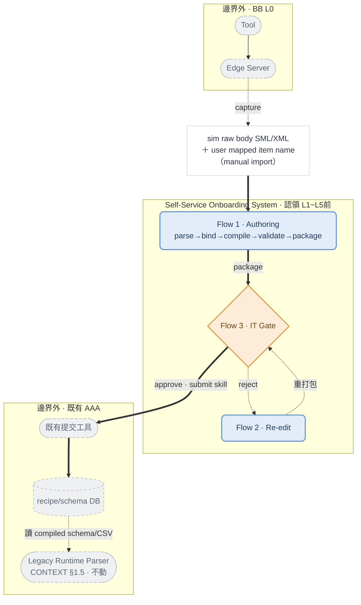
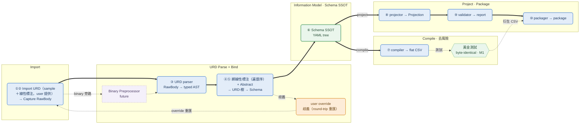
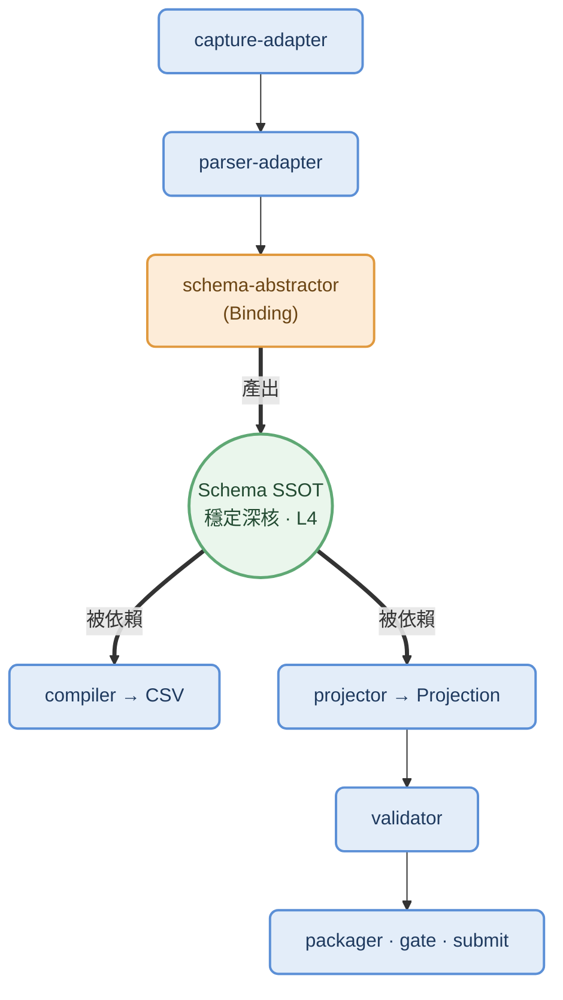

# ARCHITECTURE — Self-Service Recipe Schema Onboarding System

> Status: Draft for engineer grill
> 定位：**執行層技術架構（HOW）**。視角＝**資料流 + data model**（HYPER_SPEC 用能力分層、PRD 用概念模型，本檔縫合並落到工程）。
> 路徑說明：本檔位於 `docs/architecture/`；全套 doc 結構見 `README.md` 文件地圖。

**Contents**

- **0.** How to Read
- **1.** System Context — Two Flows & Scope Boundary
  - 1.1 Delivered Specs ↔ Modules
- **2.** Data Flow — Pipeline + Object Flow
  - 2.1 Stage View — Pipeline
  - 2.2 Object View — Document Flow
- **3.** Data Model
  - 3.1 Tree Schema Node Model
  - 3.2 Metadata Layers (A intrinsic · B derived · C submit)
  - 3.3 Offset Derivation
- **4.** Modules
  - 4.1 Module × Function Catalog
  - 4.2 Dependency Topology (Star at the Schema SSOT)
  - 4.3 Deep Module Contracts
  - 4.4 Extensions
- **5.** Validation Architecture
- **6.** Package Structure
- **7.** Dual Mode — strict / compat Implementation
  - 7.1 T4/T5 — compat→strict Bootstrap Pipeline
- **8.** Boundary Interfaces
  - 8.1 Submit Skill Contract
  - 8.2 ParserRegistry Metadata Emit
- **9.** Error / Failure Model
- **10.** Open / Blocking-Open
- **11.** Test Strategy

---

## 0. How to Read

**三文件分工（不重述、只引用）**：

| 文件 | 回答 | 本檔關係 |
|------|------|---------|
| `PRD.md` | **WHAT**：產品意圖、概念模型、user story、分期 | 引用其 §4/§5/§8/§10/§11/§12 |
| `CONTEXT.md` | **領域基底 + 決策**：parser 真實機制、dispatch 契約、metadata model、ADR | 引用其 §1.4~§1.7、§2 |
| **`ARCHITECTURE.md`（本檔）** | **HOW**：資料流＋物件流（§2）、data model（§3）、模組（§4）、validation/package/模式/邊界/錯誤（§5–§9） | — |

> 凡 CONTEXT 已定的領域事實（parser ①②、OFFSET/NEXT_LEVEL 契約、dispatch 推斷、metadata 三層），本檔**引用不重抄**。
> 標籤沿用：`[decided]` / `[open]` / `[constraint]` / `[blocking-open]`。Mermaid 強調靠 classDef，不用 HTML 標籤。

**一頁心智模型**：本系統在 authoring 期**產生** schema；既有 runtime parser **不動**，靠本系統 compile 出的 flat CSV 餵養。兩條流的關係見 `CONTEXT.md §1.5`。

**閱讀弧**：脈絡（§1）→ 資料流＋文件物件（§2）→ data model（§3）→ 模組三鏡頭（§4）→ validation / package / 模式 / 邊界 / 錯誤（§5–§9）→ open / 測試（§10–§11）。

---

## 1. System Context — Two Flows & Scope Boundary

本系統認領 AAA 能力分層 **L1~L4 + L5 前段**（HYPER_SPEC A.1）。它與環境的關係：



**認領邊界** `[constraint]`（HYPER_SPEC A.3 / PRD §10）：
- **入**：機台的 recipe simulation raw body（SML/XML），連同 user 標註的「mapped recipe item name」，一起 manual import 進系統。
- **出**：通過檢驗的 IT-approved package，經 submit skill 交給既有提交工具、寫進 DB schema table。
  - *檢驗*：整合介接既有 Parser codes，確認 body+schema 是 valid 且可 parse。
  - *submit skill*：整合進本系統 user flow UI 的薄 wrapper，在 UI 內觸發，不是系統外的手動步驟。
- **不做**（皆邊界外，屬 AAA/BB）：DB 寫入、recipe 生命週期、comparison、release / rollback / golden、deploy 執行。
  - 唯一例外：**deploy 觸發**——一層薄 wrapper（Flow 4，性質同 submit；PRD §10.2）。
- **怎麼接舊世界**：authoring 把 schema 編譯成 flat CSV，隨 package 提交入 DB；**既有 runtime parser 原樣讀這份 CSV**。這就是「parser 不動」的物理意義。

### 1.1 Delivered Specs ↔ Modules

> **本架構的交付物必須包含下表這些 spec**——它們是**待產出的第一級交付物，不是參考資料**（本系統的交付物 ＝ 一套 recipe schema 系統 ＝ 這套 spec）。
>
> 下表每欄的意思：
> - *實作模組／產出方式*：每份 spec 由哪個模組（§4.1）實作，或以什麼方式產出。
> - *內容現址*：目前該 spec 的內容散落在哪。
> - *優先*：優先序／狀態以 **`PRD §12.0`（權威 deliverable）** 為準。

| Spec | 實作模組（§4.1）／產出方式 | 內容現址 | 優先 |
|---|---|---|---|
| **Recipe Schema Meta Spec** | schema-abstractor · compiler | §3.1 node model · §3.3 offset | P1 |
| **Recipe Body Spec** | parser-adapter | §3.1（型別/secsType）· `CONTEXT §1.2` | P1 |
| **URD Input Format Spec** | URD parser（parse-adapter＋urd-binder）· validator(`URD###`) | §4.3 · §5 · `PRD §8.1` · D22 | P1（gated 會議#2）|
| **Runtime Parser Behavior Spec** | **逆向產出**（runtime 本身＝legacy 不動,但其行為契約須我們逆向寫出;parser-adapter「AST≅①」與 compiler golden 皆依賴它）| `CONTEXT §1.5` · §9/§10 | P1（去風險·BO-4）|
| Vendor Adapter Spec | parser-adapter / abstractor 擴充 | §4.4 擴充點 · §7 compat | P2 / future |
| AAA Interface Profile | gate/submit/deploy 薄 wrapper（reference）| §8 | 不產（reference, D17）|

---

## 2. Data Flow — Pipeline + Object Flow

本節講 **data flow**——唯一的實質資料轉換 pipeline，不是 user flow。

那 4 個 **user flow**（PRD §10、§1 脈絡圖）是**圍著這一條 pipeline 的編排**，不是 4 條獨立 pipeline：
- **Author**：完整走一遍 pipeline。
- **Re-edit**：重新進入同一條（載入既有 schema → 改 → 重編 → 重打包）。
- **Gate**：對 pipeline 產物的控制決策（approve / reject）。
- **Deploy**：pipeline 之後的下游觸發（薄 wrapper，邊界外）。

> 模組的功能契約見 §4.1；本節給流程（做什麼）＋文件物件流（什麼在流）。

### 2.1 Stage View — Pipeline

下圖是這條 **authoring pipeline 的 strict 主幹**，由左到右走完各階段。兩軸正交（PRD §5.2）：格式軸（formatted / XML / binary）、模式軸（strict / compat）。

主幹之外有兩條**替代處理路徑**（都匯回主幹、非獨立 pipeline）：
- **旁路 A** binary preprocessor — binary body 先轉成可解析形態再進主幹（future，圖中細虛線）。
- **旁路 B** compat bootstrap — 沒有乾淨 sample 時，拿既有 CSV+RawBody 反推一棵骨架樹當起點，加速 onboard（詳 §7.1 / D21；不在本圖）。

其餘**細虛線**只是註記、非路徑：override（回饋迴圈）、黃金測試（去風險閘）、衍生 CSV（輸出邊）。



**各階段功能（流程敘述）**——每步「做什麼」；形式契約見 §4.1：
- **①② Import**：user 提供 **URD ＝ sample（RawBody）＋ 線性標注**（manual import，D22）；`Capture` 把 sample 落成不可變 **RawBody**（+checksum）。
- **③ URD parse**：`URD parser` 把 RawBody 遞迴解成 **typed AST**（schema-agnostic，靠 SECS-II header，不需 schema）。
- **④⑤ Bind + Abstract**：`URD parser` 把 user 的**線性標注按深度優先遍歷序綁回 AST 節點** → **URD-樹**；再 `Abstract` **結構保真**轉成 **Schema SSOT**（D16，不重整樹形）並貼 dispatch（主流 C/NC/L/GF/B/NF 多由形狀直接定、C/NC 有預設，**非智能分類**；硬情況 TAG-based／動態已由 D18/D19 砍出 MVP）。標注對不齊或拿不準（遍歷序錯位、形狀撞型、sample 缺分支）**不靜默猜**，發 warning 要 user 改標注**重匯**（round-trip；D6/D13/D22）。
- **⑥ Information Model**：**Schema SSOT**（YAML tree）＝單一真相；下游的 CSV / Projection / Package 全由它衍生。
- **⑦ Compile**：把 Schema 樹編成 **flat CSV**——就是 legacy runtime 在讀的那份；黃金測試鎖定它與舊 CSV **逐 byte 一致**（證明「parser 不動」）。
- **⑧ Project**：把 RawBody 按 Schema 解讀成 **Projection**——一份人類可讀的語意檢視，供 onboarding 期確認（非 runtime 物件，D9）。
- **⑨ Validate**：跑四道驗證、輸出 **report**（§5）。
- **⑩ Package**：把 user 區＋IT 區的產物打包成 **Package**（§6），再送 gate → submit。

**控制流要點**：
- **④⑤ 是 bind→abstract（MVP 走 round-trip，非 inline）**：URD parser 按遍歷序把線性標注綁回 AST → URD-樹 → abstract 成 Schema、貼 dispatch（主流 C/NC/L/GF/B/NF 多由形狀直接定、C/NC 有預設，**非智能分類**）；對不齊／拿不準（遍歷序錯位 / 形狀碰撞 / 單一 sample 缺分支）發 warning 要 user 改標注**重匯**、**不靜默猜**（D6/D13/D22；後期 UI 才 inline；機制見 `CONTEXT.md §1.4.1`）。
- **offset 是衍生值、⑦ 才產生**：Schema 樹不存 offset，compile 時才由樹推導出來（機制＝重現 `parseFItem` 遍歷，見 §3.3）。
- **黃金測試是去風險閘**（M1）：⑦ 的輸出與既有 Excel→CSV 逐 byte 一致 → 證明 parser 不動可行。
- **⑧⑨ 與 ⑦ 並行**：project 供檢視/驗證，compile 供 runtime；兩者都從同一 Schema SSOT 出。

### 2.2 Object View — Document Flow

> stage 視角看「步驟」；本圖看「**什麼物件在流、形態是 tree 還是 serialized**」。

```mermaid
%%{init: {'theme':'base','themeVariables':{'fontFamily':'-apple-system, Segoe UI, Helvetica, Arial, sans-serif','fontSize':'13px','lineColor':'#9aa5b1','primaryTextColor':'#2d3748'},'flowchart':{'curve':'basis','nodeSpacing':30,'rankSpacing':40}}%%
flowchart LR
    SMP["Sample<br/>SML/XML · serialized"]:::ser
    ANO["線性標注<br/>serialized · user 提供"]:::ser
    RAW["RawBody<br/>serialized · 不可變"]:::ser
    AST["AST<br/>tree"]:::tree
    URD["URD-樹 = AST+綁定標注<br/>tree"]:::tree
    SCH(("Schema SSOT<br/>tree")):::core
    CSV["flat CSV<br/>serialized · 衍生"]:::ser
    PRJ["Projection<br/>tree"]:::tree
    RPT["Report"]:::ser
    PKG["Package.zip<br/>serialized"]:::ser
    EXT(["邊界 · 既有工具 → DB"]):::ext

    SMP -->|Capture| RAW -->|URD parse| AST -->|bind 線性標注 遍歷序| URD -->|Abstract| SCH
    ANO -->|bind| URD
    SCH -->|Convert·compile| CSV
    SCH -->|Convert·project| PRJ -->|Validate by Schema| RPT
    RAW -->|+ RawBody（project 吃兩個輸入）| PRJ
    RAW -. bundle .-> PKG
    CSV -. bundle .-> PKG
    RPT -. bundle .-> PKG
    SCH -. bundle .-> PKG
    PKG -->|Gate → Submit| EXT

    classDef tree fill:#e3edf9,stroke:#5b8fd6,stroke-width:2px,color:#1f3a5f,rx:6,ry:6;
    classDef ser fill:#fdf3e3,stroke:#d99a3e,color:#6b4514,rx:6,ry:6;
    classDef core fill:#eaf6ec,stroke:#5fa874,stroke-width:2.5px,color:#234b32;
    classDef ext fill:#eef0f2,stroke:#aab2bd,color:#5a6470,stroke-dasharray:5 4;
```



> 藍＝tree（記憶體結構）｜橘＝serialized（落地／傳輸 doc）｜綠＝Schema SSOT（單一真相）。實線＝**轉換**（A 變成 B）；虛線 `bundle`＝**被 Pack ⑩ 收進 package**（containment，非轉換）。**YAML 是 Schema 的序列化、CSV 是由 Schema 衍生（D1/D20），非二選一。**
>
> **compile 與 project 是 Schema SSOT 岔出的兩條獨立分支**：`flat CSV = compile(Schema)`（只吃 Schema，是 schema 導航地圖、餵 runtime）；`Projection = project(RawBody, Schema)`（吃兩個輸入，是某筆 recipe 解讀後的語意檢視、給人看，D9）。**CSV 不經過 Projection。**

**文件物件表**（形態 · 角色 · 流轉 · 落點；欄位級 data model 見 §3）：

| 物件 | 形態 | 角色 | 不可變? | 產生（函式）| 序列化 | 入 package |
|---|---|---|---|---|---|---|
| Sample | serialized（SML/XML）| **URD 輸入**的一半：機台 recipe 原始 body | — | import（外部）| — | （Capture→RawBody）|
| 線性標注 | serialized | **URD 輸入**的另一半：user 標的 mapped item name（3 欄＋override，D22）| user 提供 | import（外部）| Excel/CSV 過渡 | （綁入 URD-樹）|
| **RawBody** | serialized（bytes）| 原始 body + 擷取 metadata（一等公民 D8）| ✅ 不可變 | Capture | `rawbody.bin` | ✅ user/ |
| **AST** | **tree** | URD parser 解 RawBody 得的 typed 結構樹（含 unused）| 衍生（可 re-parse）| URD parse | —（可重建）| ❌ |
| **URD-樹** | **tree** | AST + 綁定 user 線性標注（遍歷序）＝ binding surface（D22）| 衍生 | URD parser bind | —（不落地）| ❌ |
| **Schema SSOT** | **tree** | 同構於 AST 的語意 tree（§3.1）| 版本化 | Abstract | `schema.yaml` | ✅ user/ |
| **flat CSV** | serialized（table）| compiler 衍生地圖（餵 runtime）| 衍生（可重算）| Convert·compile | `recipe.csv` | ✅ user/ |
| **Projection** | **tree** | RawBody+Schema 投影的語意表達 | 衍生 | Convert·project | report/view | 選配 |
| **Report** | serialized（record）| 四道驗證結果（§5）| 衍生 | Validate | `conformance.json` | ✅ user/ |
| **Package** | serialized（zip）| 交付單位（§6）| — | Pack | `recipe-package.zip` | =本體 |
| GateResult | serialized（record）| gate 決策 + audit | — | Gate | `gate.json` | ✅ it/ |

---

## 3. Data Model

本節是**欄位級** data model：定義 tree node 結構、metadata 分層、offset 衍生。物件清單與形態見 §2 表；物件鏈與概念關係見 `PRD.md §8` 與 `CONTEXT.md §1.5`。

### 3.1 Tree Schema Node Model `[decided 模型；欄位 open]`

**這是去風險核心 F1.1**：一個 tree node 模型，要同時滿足——
- **同構於 AST**（D16，不重整樹形）
- 可被 **user 經 URD 標注**（綁線性標注，D22）
- 可被 **compiler 編譯成 flat CSV**（D1/D20）
- 可被 **validator 當尺**（驗證屬性）
- 節點型別**涵蓋 `CONTEXT.md §1.4` 的 dispatch enum**

**節點欄位**：

| 欄位 | 意義 | 來源 | 編譯到（CSV）|
|---|---|---|---|
| `name` | semantic item name | URD 第 2 欄（user）| name |
| `kind` | dispatch：`L/GF/C/NC/CPL/PVL/TC/DCPL/B/NF`（+binary `I/G/IT/TP`）| abstractor 推 + user 定案 | NEXT_LEVEL |
| `secsType` | SECS-II format code（LIST/ASCII/U4/I2/F8/Binary/Boolean…）| AST | type / length |
| `variability` | `fixed` \| `variable`（同名→variable）| URD 同名信號 | L vs 位置型 |
| `nextRef` | like-pattern（C/NC）/ tag / index | user/PDF（TAG-based）或可導 | NextRef |
| `pathMode` | `formatted` \| `binary`（B 轉換點起切換）| AST | OFFSET 語意 |
| `provenance` | `auto` \| `userOverride` \| `pdf` \| `csv-inferred`（audit / IT gate 用；`csv-inferred` = compat→strict bootstrap 由既有 CSV 推得，見 §7.1 / D21）| abstractor | （metadata B 摘要）|
| `required`,`allowedRange`,`allowedEnum`,`unit`,`default`,`length` | 驗證屬性 | URD + convention | validator 規則 |
| `children` / `childSchema` | 位置型子節點 / L 的單一複用 schema | tree | 遞迴 |
| ~~`offset`~~ | **不存**——compiler 由樹深度優先位置推導 | — | OFFSET（衍生）|

**YAML 範例**（節錄，示意 dispatch 涵蓋）：

```yaml
- name: Steps                 # 同名可變陣列
  kind: L
  secsType: LIST
  variability: variable
  provenance: auto
  childSchema:                # 每個元素複用同一 schema（NEXT_LEVEL=L 語意）
    - name: Step
      kind: GF                # 異質固定群組
      children:
        - { name: Pressure, kind: NF, secsType: F4, unit: torr, allowedRange: [10,20], required: true, provenance: user }
        - { name: Gas,      kind: NF, secsType: ASCII, provenance: user }
- name: ConditionBlock        # CCode list（形狀碰撞家族，需 nextRef）
  kind: C
  secsType: LIST
  nextRef: "10*"              # like-pattern；user/PDF 提供
  provenance: pdf
  children: [ ... ]
```

> **設計約束**（`CONTEXT.md §1.4.1` opens）：`pathMode` 處理 OFFSET 雙語意 + B 混合樹 `[open]`。`DCPL/TP` 動態節點**不再支援**（`[decided]` D18：禁 dynamic parsing，tree 維 closed-world，不加 open/dynamic 節點型別）；TAG-based 尾巴 CPL/PVL/TC 亦 MVP 不支援（D19）。

### 3.2 Metadata Layers (A intrinsic · B derived · C submit)

完整定義見 `CONTEXT.md §1.7`；本節給架構要點。三層按「何時定、能不能變」分：

| 層 | 何時定 | 可變? | 由誰產 | 是什麼 |
|---|---|---|---|---|
| **A** | 擷取期（隨 RawBody 固化）| ❌ 永不回寫 | Capture | 原始 body 的不可變事實（checksum、source…）|
| **B** | 解讀／衍生期 | ✅ 每次 re-parse/re-compile 可重算 | Parse · Abstract · Compile · Project | 各版本號、provenance 摘要…|
| **C** | 提交期（package/gate）| 提交時定 | Pack | **提交組 ＝ ParserRegistry 契約** `[blocking-open]`（§8）|

- `toolModel` 在 **A**（機台原報）與 **C**（校正後 canonical）**並存、非重複**。

### 3.3 Offset Derivation `[decided]`

**問題**：既有 flat CSV 脆弱，因為 OFFSET 是**人手寫的座標**，等於用手在隱式重建一棵樹。

**解法**：OFFSET 不再手寫，而是 **compiler 從 Schema 樹推導的純衍生值**——把樹做深度優先線性化（重現 legacy `parseFItem` 的遍歷順序），逐節點吐出 `(name, OFFSET, NEXT_LEVEL, NextRef, length, type)`。

**OFFSET 怎麼算**（依節點型別）：
- **位置型**（C/NC/GF/PVL/TC）：`OFFSET ＝ 該節點在 parent 的 1-based child index`（純由樹位置算）。
- **`L`**：不產 OFFSET（runtime 會遍歷全部 children）。
- **`B` 之後**：切到 `pathMode=binary`，OFFSET 改為 byte offset。

**為何這讓「單一 SSOT」成立**：樹一變，compiler 就重算 offset，CSV 永遠不必手維護（D1）；對齊正確性由**黃金測試**鎖死（F1.2）。

---

## 4. Modules `[open]`

同一組模組，從**三個鏡頭**看（外加擴充）：
- **§4.1 catalog** — 每個模組做什麼（簽名＝型別正本）
- **§4.2 依賴拓樸** — 它們怎麼互相依賴
- **§4.3 操作契約** — 每個 deep module 的 invariant / error / 測試標的
- **§4.4 擴充點** — 未來往哪加

**邊界與切分** `[constraint]`（HYPER_SPEC）：
- **能力 ≠ 模組**：下列皆為 deep module **候選**，實際切分由工程師定。
- **邊界外**：L0（BB 通訊）、L5 後段（release / rollback / golden / runtime governance）。
- **Projection（Layer 3）** ＝ onboarding 期投影，**≠ AAA runtime canonical object**（D9）。

### 4.1 Module × Function Catalog

每列一個模組；**簽名欄＝型別正本**（§4.3 操作契約、§3 data model 都引用它）。

| 模組 | 功能（動詞）| 簽名 | 純度 | 能力層 | golden / invariant |
|---|---|---|---|---|---|
| capture-adapter | **Capture** Sample→RawBody | `Sample → RawBody(+checksum)` | effectful | L1 | checksum 冪等 |
| parser-adapter | **Parse** RawBody→AST | `RawBody → AST` | pure | L2 | AST≅legacy①（**VB oracle**，D14）|
| urd-binder | **Bind** 線性標注→AST（遍歷序）| `(AST, 線性標注) → URD-樹` | pure | L4 入口 | 遍歷序對齊（D22）；UI inline 標注＝future Model A |
| schema-abstractor | **Abstract** URD→Schema | `URD → (Schema, Report)` | pure | L4 | 不靜默猜 D6 · 結構保真 D16 |
| compiler | **Convert** Schema→CSV | `Schema → CSV` | pure | L2（回供 runtime）| **byte-identical** legacy CSV（D20 / F1.2 golden）|
| projector | **Convert** RawBody+Schema→Projection | `(RawBody, Schema) → Projection` | pure | L3 | 版本鎖定可重現 |
| validator | **Validate** {URD∣Projection∣Package} **by** Schema→Report | `(X, Schema?) → Report` | pure | L4 / L5前 | 每違規 ↔ stable ruleCode |
| packager | **Pack** artifacts→Package | `{RawBody,Schema,CSV,Report,meta} → Package` | effectful | L5前 | round-trip · compiledFrom |
| gate / submit | **Gate / Submit**（thin wrapper · 邊界）| `(Package, …) → …Result` | shell | L5前 | 契約 §8 · BO-2/BO-3 |

> **動詞只有三種句型**：`Parse X`（解析）、`Convert A→B`（轉換：compile / project / capture / pack）、`Validate X by Y`（用 Y 當尺驗 X）。
>
> **純度欄**：5 個 `pure` ＝ Functional core，單獨決定論可測（§11 只測介面、不測內部）；`effectful` / `shell` 隔離在外殼。歧義 override 就是外殼編排——user 改標注重匯 → 重跑 Abstract，直到無歧義（D22）。
>
> **同一份契約、三個縮放層**（三者必一致）：型別簽名＝**本表**（正本）；操作級 invariant / error / 測試標的＝**§4.3**；欄位級 data model＝**§3**。

### 4.2 Dependency Topology (Star at the Schema SSOT)

> 用途＝**分層模組化**（非新人導讀）。核心洞見：**flow 上每個 artifact ＝模組的穩定介面；artifact 間的 transform ＝ deep module（§4.3）**——flow 自帶依賴骨架。
>
> 機械步驟：在 §2 線性 flow 上找「被最多 transform 讀寫的 artifact」＝ **Schema SSOT**（左側全在產它、右側全在耗它）＝**鉸鏈**；在鉸鏈處對折 → producer / consumer 全指向核心 ＝依賴星型。**flow 的中點 ＝依賴的中心。**



> **模組化規則（寫死）**：**沿穩定 artifact 切，不沿 stage 切**。§2 有 10 個 stage，§4 只有 6 個 module（①+②→capture-adapter；⑤+⑥→abstractor）——artifact 穩定、stage 內部會變。
>
> **圖中刻意校正**（對舊草圖三處漂移，是併入時的設計依據，務必保留）：
> 1. parser 機制標 `α/β/γ 待定`——typed AST 這個**產出**是鎖死 invariant，但「VB 當 front-end」仍 open（領先候選 γ＝自建 β ＋ VB① 當 oracle）。（D14 / `CONTEXT.md §1.6`）
> 2. **Transform 只裝 Binding（產 schema 那一步）**；`compile→CSV`（餵 legacy runtime＝去風險核心、舊草圖漏掉的那條）與 `project→Projection`（供驗證）是 Information model→消費端的**箭頭**，不歸在 Transform 層內。（§2 ⑦⑧ / §3.3）
> 3. **Projection 不是橫切**，只是消費箭頭之一；**真正橫切的是 metadata A/B/C ＋版本 ＋黃金測試 CI**。（D9 / `CONTEXT.md §1.7`）

### 4.3 Deep Module Contracts

以下是 deep module 候選的**操作級介面契約**（小而穩定的介面藏高複雜度）。測試對介面（輸入→輸出），不對內部（§11 測試策略）。型別簽名正本見 §4.1，欄位級 data model 見 §3。

| Deep module | 純度 | Input | Output | 不變量 / 主要錯誤 | 測試標的 |
|---|---|---|---|---|---|
| **capture-adapter** | effectful | Sample | RawBody（+ checksum, 層 A）| **RawBody 不可變 + checksum 穩定**（同一 sample 重擷取得同 checksum）；err：擷取失敗 / checksum 不符 | checksum 決定論 / re-capture 冪等 |
| **parser-adapter** | pure | RawBody（bytes + bodyFormat）| typed AST（完整含 unused）| **AST 與 legacy ① 同構**（D14 invariant）；err：壞 SECS header、截斷、不支援格式 | AST 結構斷言 vs VB oracle |
| **schema-abstractor** | pure | URD（= AST + item-name binding, HANDOFF 詞彙表; 3 欄）+（罕）PDF/profile | (Schema SSOT, Report)（ambiguity = Report 中 `source=系統推測` 子集，非另一清單）| **不靜默猜（D6）**：無法自動定案的 dispatch 必進 Report、Schema 不含猜測節點；**結構保真**（D16）：Schema 同構於 URD 內 AST（只貼語意+dispatch，不增刪節點）。capability：主流 C/NC/L/GF/B/NF 自動推斷。err：`URD001` 序號、`URD002` 歧義重複群組、無法解析碰撞 | 同名/異名、禁序號、override、dispatch 候選推斷 |
| **compiler** | pure | Schema SSOT（tree）| flat CSV（name,OFFSET,NEXT_LEVEL,NextRef,length,type）| **與既有 Excel→CSV 逐 byte 一致**（F1.2）；err：不可編譯 kind、TAG-based 缺 nextRef | 黃金回歸（byte-identical）|
| **projector** | pure | RawBody + Schema(version) | Canonical Projection（+ 用哪個 schemaVersion）| **版本鎖定可重現**（對 frozen schema）：以 Projection 記錄的 `schemaVersion` 重 project ≡ 原 Projection；draft 不承諾重現 | round-trip、schema-version 重讀 |
| **validator** | pure | (URD ∣ Projection ∣ Package, Schema?) | Report{ruleCode,severity,source,message,targetPath,suggestedAction,blocking}（三處同型，§5）| **覆蓋完整**：對 sample 中出現的結構，每違規 ↔ 一個 stable `ruleCode`。rule（validator 執行）：嚴重度綁來源（user=error / 系統=warn）| 各規則 pass/fail |
| **packager** | effectful | artifacts{RawBody, schema.yaml, CSV, metadata A/B/C, report} | package（user/IT 區；manifest 記 `compiledFrom = Schema.schemaVersion`）/ 逆：package→artifacts | err：`PKG001/002/003` | round-trip |

> **邊界模組**：`gate`（Package × decision → GateResult）、`submit`（Package × gateResult → SubmitResult）都是 thin wrapper、非 deep module，契約見 **§8**。
>
> **URD parser ＝ parser-adapter ＋ urd-binder**（D22，Model B）：
> - parser-adapter：RawBody → AST
> - urd-binder：把線性標注按遍歷序綁回 AST → URD-樹
> - MVP 標注隨 import 進來、urd-binder 機械對齊；UI 互動 inline 標注是 future（Model A）。
>
> **純度欄**：5 個 `pure` ＝ Functional core（§4.1），單獨決定論可測；2 個 `effectful`（capture / packager）測「IO 後可觀察的不變量」（checksum 穩定 / round-trip）。
>
> **version 怎麼穿過契約** `[decided 契約面；狀態機 §10 open]`：
> - `schemaVersion` 是 Schema **身分**的一部分——compile / project 操作的都是「帶 version 的 Schema」。
> - **draft**（authoring 期、可變）：產物標 `draft@workingId`，**不承諾重現**。
> - **frozen**（package/gate 固化）：產物記錄該 version，「可重現」invariant **只對 frozen 成立**。
> - `compiledFrom = Schema.schemaVersion` 由 **packager** 寫入 manifest（compiler 維持 pure），作 §5「CSV＝YAML 衍生」驗證的版本錨。
> - 完整 draft↔frozen 狀態機見 §10 `[open]`。
>
> **error code 正本 ＝ §5 registry** `[decided]`（如 `URD001_INVALID_SEQUENCE_NAME`；PRD §11.1 引用本檔）。本表只用簡碼（`URD001` / `PKG001-003`）；namespace 擴充慣例 `[open]`。注意 **§9 是失敗分類（另一軸），不是 code registry**。

### 4.4 Extensions

擴充都是**層加在主幹上、不改主幹形狀**（呼應 D16）。

| 擴充 | 怎麼層上 | 狀態 |
|------|---------|------|
| TAG-based dispatch（CPL/PVL/TC）| `Abstract` 歧義→override + 選擇性 dispatch profile/PDF | MVP 不支援（D19）；future 重用 |
| binary 格式 | `Parse` 前插 Binary Preprocessor | future |
| compat 模式 | `Capture` → 既有 CSV passthrough → `Pack`（跳過 parse/abstract/compile）| §7 |
| 動態節點（DCPL/TP）| — | **不支援**（D18：禁 dynamic，tree 維 closed-world）|
| 多格式（XML）| 另一前端餵入同一 AST | target |
| metadata 層 B 衍生版本欄 | 需要時補（structuralParser/abstractor/compilerVersion）| YAGNI |

---

## 5. Validation Architecture

四個驗證點（PRD §11.1）在 pipeline 的落位：

| # | 驗證 | Pipeline 位置 | 驗什麼 | rule code | 負責 |
|---|------|--------------|--------|-----------|------|
| 1 | URD spec validation | ④⑤ 綁定後 | 匯入的 URD 合 template/convention（禁序號…）| `URD###` | toolkit |
| 2 | Conformance check | ⑨ project 後 | projection 對抽象 schema 是否相符 | `CONF###` | toolkit |
| 3 | Package validation | ⑩ build + Flow2/3 入口 | zip 完整、YAML 合法、**CSV=YAML 衍生**、report 最新、metadata（含 C 層）齊 | `PKG###`,`META###` | toolkit |
| 4 | 模擬正確性 | submit 時 | 既有工具行為 | — | 邊界外 `[open]` |

- **Report schema**（最小欄位，**本檔為正本**）：`ruleCode, severity, source, message, targetPath, suggestedAction, blocking`。穩定 rule code 利測試、結構化 reject、Flow 2 高亮、稽核。
- **Rule code registry**（**本檔為正本**，`[decided]`；清單為起點可擴充）：
  ```
  URD001_INVALID_SEQUENCE_NAME      URD002_AMBIGUOUS_REPEAT_GROUP
  CONF001_REQUIRED_FIELD_MISSING    CONF002_TYPE_MISMATCH
  PKG001_MISSING_REQUIRED_ARTIFACT  PKG002_CSV_NOT_DERIVED_FROM_YAML
  PKG003_REPORT_OUTDATED            META001_MISSING_PARSER_METADATA
  ```
- **嚴重度綁來源** `[decided]`：user 明確確認→`error`；系統推測→`warn`。這也對應 `provenance`（§3.1）。
- **Validation 與 Comparison 分離**（D11 / AAA Rule 7）：comparison 在邊界外，本架構不做。
- rule code namespace 編碼慣例 `[open]`（PRD §11.1 引用本檔）。

---

## 6. Package Structure `[decided 提案；細節 open]`

package-centric（不依賴中心 DB，為流通），檔案結構分 **user 區 / IT 區**（PRD §10）：

```
recipe-package.zip
├── manifest.json          # metadata 三層 (A/B/C) + 各 artifact checksum + schemaVersion
├── user/                  # user 貢獻（語意正確性）
│   ├── rawbody.bin        # RawBody（層 A），checksum 為完整性錨
│   ├── schema.yaml        # Schema SSOT（tree，§3.1）
│   ├── recipe.csv         # compiler 衍生地圖（PKG002 可重算驗證）
│   └── conformance.json   # conformance report（§5）
└── it/                    # IT 貢獻（技術正確性）
    ├── gate.json          # gate 決策 + approve/reject + audit trail
    └── reject_reason.json # 結構化退回原因（綁 rule code）→ Flow 2 高亮
```

- `manifest.json` 承載 metadata 三層；C 層含 ParserRegistry 契約組（§8）。
- IT 區只在 gate 後出現；reject 時 `reject_reason.json` 綁 package 回 Flow 2（US-2），IM/郵件僅通知。

---

## 7. Dual Mode — strict / compat Implementation

PRD §4。格式軸 × 模式軸正交。

| | strict（新機台預設）| compat（舊機台，永久支援）|
|---|---|---|
| Schema | 走 §2 完整 authoring，產 tree SSOT | **保留既有 flat CSV，不抽象**；本系統僅 capture RawBody + 打包 + metadata |
| E5 合規 | 強制對齊 | 不追溯要求 |
| pipeline | ③~⑩ 全程 | 旁路：②Capture → 既有 CSV passthrough → ⑩Package |

- **單向升級閘門** `[decided]`：compat→strict 為 strict 入口（非自動升維、不存在「半驗證的 compat tree」、非額外元件），有**兩條路徑**：
  - **甲（現狀）** — 用保存的 **RawBody 重走一次完整 strict onboard**，缺的型別/可變性由 user 重新提供。
  - **乙（加速旁路 · D21）** — 既有 **CSV 當地圖 + RawBody → bootstrap 骨架樹**，user 只補差（變異性/約束/語意）；適用已 onboard、已存 CSV 的 recipe。pipeline 見 §7.1。
- **新機台預設 strict** `[constraint]`（PRD §4）：走 compat 需明確例外核准，理由記於 package metadata（C 層）。

### 7.1 T4/T5 — compat→strict Bootstrap Pipeline `[decided 大方向；機制隨 M1 spike，配 D14]`

升級閘門乙路徑（§7 · D21）的資料流——把「已 onboard、已存 CSV」的 recipe 從 compat 拉進 strict，不必從零：

```
既有 CSV + RawBody
  → [CSV 當地圖 parse RawBody]      # CSV＝flat 導航地圖，逆 D20 序列化方向
  → 骨架樹（結構 + 型別 + 值）        # 由 CSV+RawBody 推得，節點標 provenance=csv-inferred
  → user 補差（變異性 / 約束 / 語意）  # 單一 sample 缺的分支/約束靠 user
  → YAML SSOT
```

- **provenance**：bootstrap 推得的節點標 `provenance=csv-inferred`（§3.1），與 user/pdf 來源區分，供 IT gate 與 audit 辨識「哪些是機器推的、待人確認」。
- **單一 sample 風險**（配 **D7**）：CSV+RawBody 仍只反映出現過的結構；未出現分支/變異性需 user 補，csv-inferred ≠ 已驗證。
- **與 §2 主 pipeline 的關係**：這是 **compat 入 strict 的加速旁路，非取代主幹**——新機台仍走 §2 完整 authoring；乙路徑只服務「已有 CSV 的存量 recipe」去風險升級。
- **批次化**：大量存量一次轉 YAML 的 migration 工具**現階段不做**（推斷風險正比規模，見 `DECISIONS §3`）。

---

## 8. Boundary Interfaces

### 8.1 Submit Skill Contract

thin wrapper，本系統與既有工具的邊界，**整合進 user flow UI**（在 UI 內觸發，非系統外手動步驟）。shape `[decided]`：
```
Input ：approved package, package checksum, gate result, submitter identity,
        approval timestamp, target environment（如適用）
Output：submit status, submit log reference, external tool transaction id,
        error code / message（失敗時）
```
**與既有工具的欄位對應** `[blocking-open]`：擋 F3.4，待與既有工具確認。

### 8.2 ParserRegistry Metadata Emit

這就是 **metadata 層 C**（§3.2）。ParserRegistry 在邊界外（可能是既有 AAA DB 表），但 package **必須 emit 足夠 metadata 供其選 parser**。最小契約 `[blocking-open]`（PRD §5 / HYPER_SPEC C.3 / `CONTEXT.md §1.7` C 層）：
```
bodyFormat, toolType, toolModel(canonical), recipeType, schemaVersion,
vendorFormatVersion, parserHint, strictMode/compatMode,
sourceSystem, ppid, rawBodyChecksum
```
**擋 F2.5 package 輸出**；確切欄位與既有 AAA 的對應待確認 → package format 解決前不視為穩定。

---

## 9. Error / Failure Model

跨 pipeline 的失敗分類與處置（架構級，PRD 未展開）。

**設計原則**：
- **Fail-loud、不 silent-wrong**：不確定就停下報給 user，**絕不靜默猜**（D6）——默默產出錯 recipe 比擋下來嚴重得多。
- **硬阻 vs 軟阻**：會讓 recipe 被誤讀／產錯的（parse error、compile mismatch）一律**硬阻**；只是需要 user 做決定的（ambiguity）為**軟阻**。
- **嚴重度綁來源**：user 明確確認＝`error`、系統推測＝`warn`（對應 provenance §3.1、§5）。
- **每個失敗 ↔ 一個 stable rule code**（驗證類）：利結構化 reject、Flow 2 高亮、稽核。

**欄位**：**類別**＝失敗種類；**來源 stage**＝在 §2 哪一步（①–⑩）發生；**處置**＝怎麼處理；**阻擋?**＝是否擋住流程（硬阻＝必停／軟阻＝待 user 決）。

| 類別 | 來源 stage | 處置 | 阻擋? |
|------|-----------|------|------|
| **Parse error** | ③ | 壞 SECS header / 截斷 → 報錯、不產 AST | ✅ 硬阻 |
| **Ambiguity** | ④⑤ | 形狀碰撞 / 單一 sample 缺分支 → **warning 要 user 改標注重匯（override），不靜默猜**（D6/D22）| 軟阻（需 user 決）|
| **URD spec error** | ⑤ | 序號命名等違規 → `URD###` | ✅ |
| **Conformance error/warn** | ⑨ | 嚴重度綁來源（user=error / 系統=warn）| error 阻、warn 提示 |
| **Compile mismatch** | ⑦ | 黃金測試不過 → parser 會誤讀，必阻 | ✅ 硬阻（M1 去風險核心）|
| **Package validation** | ⑩ / Flow2-3 | zip/YAML/CSV衍生/report 新鮮/metadata → `PKG###`/`META###` | ✅ |

- **單一 sample 限制** `[constraint]`：缺「未出現分支」的結構無法推斷 → 歸 ambiguity，顯式要 user 補（PRD §8.1）。

---

## 10. Open / Blocking-Open

**Blocking-Open（擋交付）**：
- **ParserRegistry metadata 契約**（§8.2）— 擋 F2.5。
- **Submit skill 欄位對應**（§8.1）— 擋 F3.4。

**架構級 Open**：
- **AST 取得機制 α/β/γ** `[deferred→M1 spike]`（D14 / `CONTEXT.md §1.6`）。
- **schemaVersion draft↔frozen 語意**（authoring 期 schema 未定版，`CONTEXT.md §1.7`）。
- **compiler 的 OFFSET 雙語意 + B 混合樹**、**DCPL/TP 動態節點型別**（`CONTEXT.md §1.4.1`）。
- **rule code namespace 慣例**、**ambiguity override UX 完整列舉**、**format 80/15/5 inventory 驗證**（PRD §13）。
- **既有工具「模擬正確性」驗證面向**、**E172/E173 適用性**、**unformatted Python preparser 中繼**（future）。

> 完整 open 清單與 grill 指引見 `DECISIONS.md`；決策理由見 `CONTEXT.md §2`（ADR D1~D22）。

---

## 11. Test Strategy

本節自 PRD §11.3 移入（測試層次屬實作層指引）。兩條原則：

- **種子原則**：每個 user story（PRD §9）的「驗收條件」＝一個測試標的的種子。
- **測試對象**：deep module 優先測**介面契約**（§4.3）、不測內部（呼應 §4.1 functional core）。

| Test Layer | 測什麼 | 對應 |
|--------|--------|------|
| **Golden Regression Test** | compiler 編譯出的 flat CSV 與既有 Excel→CSV **逐 byte 一致** | F1.2（去風險核心）；保證 parser 不動 |
| **Unit Test (UT)** | tree schema model、convention 判定（同名=陣列、禁序號）、override、offset 衍生計算 | US-1.3 / US-1.5 |
| **Validation Test** | 四道驗證各自的 pass/fail（URD spec、conformance、package、report 嚴重度分級） | §5 + PRD US 驗收 |
| **Round-trip Test** | URD → schema → package → 重新載入 → 一致（Flow 1 ↔ Flow 2） | US-2 |
| **Boundary Test** | submit skill 正確 invoke 既有工具（mock 既有工具，不測其內部） | US-3.3 |

原則：
- **每個 user story 的驗收條件 → 至少一個測試**（TDD 標的）。
- **deep module 優先測介面**（§4.3）：對 compiler / parser-adapter / validator 測「輸入→輸出」契約，不測內部實作。
- 既有工具的「模擬正確性」`[open]`（驗證面向待調查，→ DECISIONS）—— 邊界外，本系統只 mock 其介面。
