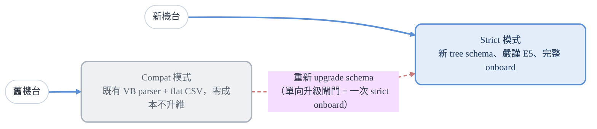
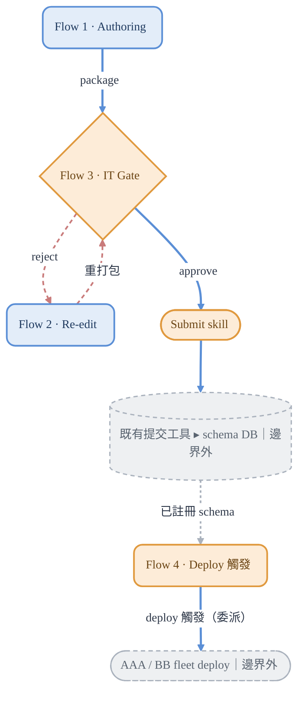
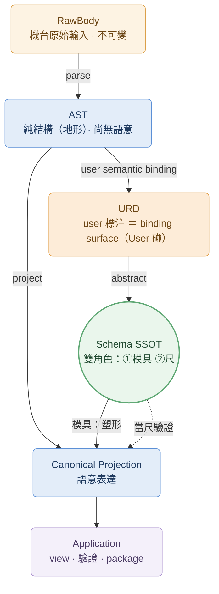

# PRD — Self-Service Recipe Schema Onboarding System

> Status: Draft for engineer grill
> 作者：PM + Architect ｜ 讀者：接手工程師 (Architect + Developer)、Claude Code
> 配套文件：`HYPER_SPEC.md`（體系總綱）、`REFACTOR_STANDARD.md`（能力分層參考框架）、
> `ARCHITECTURE.md`、`DECISIONS.md`、`HANDOFF.md`
>
> 定位：本系統實作 recipe schema 能力分層的 authoring 段（Layer 1~4 + Layer 5 前段），
> 讓 user 自助 onboard schema。**不是重寫 AAA**；能力分層與認領範圍見 HYPER_SPEC。
> 標籤（`[success-metric]`/`[constraint]`/`[decided]`/`[open]`/`[blocking-open]`）定義與 grill 權限見 `HANDOFF §1`。

---

## 1. 問題陳述

半導體設備 recipe 的 schema 上線（onboarding）目前是 IT-bound 的瓶頸：

- recipe 的結構知識掌握在 process engineer / equipment owner（最懂 recipe 的人）手上，
  但他們**無法自行產生** machine-readable schema。
- 現行流程的兩種瓶頸：
  - **Formatted（80%）**：user 提供 URD → IT 工程師手工建立 schema → **約需 3 天**。
  - **Binary / unformatted（15%）**：特定機台廠商只能輸出 binary，每一支都必須額外
    撰寫 dll preparser → **每支約需 1~2 週**。
- schema 的真相目前散落在 process engineer 編寫的 Excel（flat、offset-based、無版控、
  無驗證），結構脆弱、改了沒人知道壞。

**根本問題（技術面）**：現行 schema 用 flat 地圖（offset + next_level 導航指令）描述本質
為 tree 的結構，靠隱式重建 → 巢狀難表達、offset 脆弱、不可驗證。詳見 ARCHITECTURE。

---

## 2. 目標與價值主張

### 2.1 價值主張：Shift-Left `[decided]`

把 schema 建立從 IT 移到最懂 recipe 的 user，IT 角色從「建立者」降為「把關者」。

```
舊：user 給 URD → IT 建 schema（formatted 約 3 天；binary preparser 每支 1~2 週）
新：user 自助建 schema → IT 人工 gate（分鐘級）→ invoke 既有提交工具
```

### 2.2 成功指標 `[success-metric]`（PM 定義，不可由工程師變更）

- **M1**：schema onboarding 時間大幅縮短。Baseline：formatted 手工約 **3 天**、
  binary preparser 每支 **1~2 週**。**Target candidate：formatted onboarding ≤ 4 小時**。
  Status：`[暫定目標 provisional，待 PM 以 baseline 驗證；指標本身不可動]`。
- **M2**：**Target candidate：IT 在單一 package 上的 gate 動作 ≤ 60 分鐘**（技術正確性由系統預驗）。
  Status：`[暫定目標 provisional，待 PM 驗證]`。
- **M3**：user 無需理解 machine-readable schema 即可完成 semantic binding（語意標注）。

### 2.3 非目標（明確排除）`[constraint]`

- ❌ 不改既有 VB parser core（只 wrap adapter）。
- ❌ 不要求 user 直接編輯 machine-readable schema。
- ❌ 不做多範例歸納（單一 sample 前提，見 §8）。
- ❌ 不實作 recipe/schema DB 的寫入邏輯（invoke 既有提交工具，見 §10 邊界）。
- ❌ 不依賴線上中心 DB（package-centric，為流通）。

---

## 3. 系統定位與標準依據

### 3.1 系統定位 `[decided]`

本系統為 **AAA（Recipe Management System）生態中的 schema onboarding / authoring 工具**。

- 它負責：讓 user 在機台輸出的 SML/XML 上做 semantic binding（標注 item name），產出可驗證的 schema package。
- 它**不負責**：recipe 的生命週期管理（選用、傳輸、狀態機、生效）——這些由既有 AAA /
  既有提交工具承擔，在本系統**邊界外**（見 §10 系統邊界）。

**承接 AAA Standard 核心原則** `[constraint]`：**通訊訊息（如 S7F26）是 input carrier，不是 schema** —— Formatted SECS-II 給的是 syntactic 結構，不等於 semantic schema；本系統**絕不把通訊訊息結構直接當 schema**，必經 semantic binding 抽象。（背景見 `CONTEXT` guardrail 3 / D17）

### 3.2 標準依據 `[constraint]`

核心：**SEMI E5 (SECS-II)** 是型別地基（strict 強制對齊，見 §4）；**E42 (AAA)** 定位對齊但不實作其管理行為；
**E172/E173** 適用性 `[open]`。完整標準對照表見**附錄 A.1**。

---

## 4. 雙模式與向後相容策略 `[decided]`

新 schema model 是為了**嚴謹定義未來新機台的 onboard**。但既有 VB parser 已運行二十年、
難以直接抽換，因此系統採**雙模式平行管線 + 單向升級閘門**。

### 4.1 兩條平行管線



> **粗藍** = 各自的進入管線　**紅虛線** = 單向升級閘門（compat → strict，只能單向）。
> 升級 = 走一次完整 strict onboard，缺的型別/可變性由 user 重新提供，**不存在半驗證的 compat tree**。

### 4.2 設計立場

- **Compat 永久支援**：舊機台可留在 compat 直到退役，完全不動。
- **Compat 是一等公民**：其「一等」不在於享受新下游能力，而在於**升級通道永遠開放**。
  Compat 機台與 Strict 機台地位平等，差別僅是「尚未升級」vs「已升級」。
- **升級 = 一次新 onboard**，非自動升維。缺的型別/可變性由 user 在 onboard 時重新提供，
  **非系統去猜舊 CSV**。因此不存在「半驗證的 compat tree」。
- **兩管線獨立**，僅在升級閘門交會（該交會點即 Strict 管線入口，非額外元件）。

**新機台預設政策** `[constraint]`（Product Commitment）：**新機台 onboarding 一律預設走 Strict 模式。**
新機台若要走 Compat，需**明確例外核准**，且**理由記錄於 package metadata**。
理由：若無此規則，團隊可能為求快把新機台丟進 compat，導致 strict 永遠不會成為預設標準。
Compat 是遷移/支援策略，**不是新機台的預設路徑**。

### 4.3 E5 合規分模式

- **Strict**：強制對齊 SEMI E5 型別系統。
- **Compat**：沿用既有行為，**不追溯要求** E5 完整性（舊資產原樣保留）。

---

## 5. 格式支援與策略

### 5.1 既有 parser 格式現況（資料依據）

摘要 `[open]`：**Formatted 80%（本產品主痛點）/ Unformatted-Binary 15% / XML 5%**；佔比為
**待驗證的 working assumption**，驅動 roadmap 優先序。完整佔比表、處理方式與數據來源警語見**附錄 A.2**。
非自描述的廠商二進位格式，本文件統一稱 **Unformatted / Binary** `[decided]`。

### 5.2 格式軸 × 模式軸（正交關係）`[decided]`

格式軸（能否自描述）與模式軸（strict/compat）是**正交的兩個維度**，不是子集關係：

|  | formatted | xml | unformatted |
|--|-----------|-----|-------------|
| **strict** | 新機台嚴謹 onboard | 新機台嚴謹 onboard | 需 preparser 中繼打通才可行 |
| **compat** | 舊機台原樣 | 舊機台原樣 | 既有 preparse .dll |

> 格式軸凌駕於模式軸：unformatted 是橫切的格式限制——不論 strict/compat，
> 都需先解決「非自描述」問題才能進新 info model。

### 5.3 策略立場 `[decided]`

> **MVP 範圍聲明** `[decided]`：**MVP 交付聚焦 formatted recipe onboarding。**
> XML 是 target 自描述格式,但**除非 PM 明確把它拉進 MVP,否則不視為 M2 的必交項**——
> 工程師不應假設 M2 必須同時交付 formatted + XML。Unformatted/Binary 為 future/open。

- **即刻**：與 tool vendor 協商，降低 unformatted 佔比、引導走 formatted / XML
  （從源頭減少問題，而非工程硬啃）。
  - 成本依據：每支 binary preparser dll 約需 **1~2 週**開發；從源頭 nego 掉 unformatted
    的 ROI 遠高於逐支工程兼容。
- **下一期**：新 info model 兼容 **formatted + XML**（自描述，直接進）；
  架構為 unformatted **預留 preparser 中繼入口**，但不實作。
- **後期 open** `[open]`：Python preparser module 打通 unformatted 中繼。
  現階段**不做 VB/Python 混合兼容**（複雜度高、收益低 15%）。
  - 入口是否打通，取決於 preparser 能否輸出「可進 tree 的中繼產物」；
    現有 VB preparser 可能不行 → unformatted 現階段仍走 compat。

> **ParserRegistry metadata 契約** `[blocking-open]`：parser 選擇機制（ParserRegistry，metadata-driven）屬 AAA 母架構層、在本系統邊界外（可能已是既有 AAA 的 DB 表）。本系統**不擁有 registry，但必須產出其所需的 metadata**。
> **此契約必須在 F2.5（Package 輸出）前解決**——package 若缺選 parser 所需 metadata 即無用；解決前 package format 不視為穩定。
> 最小 metadata 欄位契約見 **`ARCHITECTURE §8.2`（SSOT）**；確切欄位與對應規則待與既有 AAA 確認（追蹤見 `DECISIONS BO-1`）。

---

## 6. 使用者與角色

### 6.1 系統使用者（兩個 persona）

| Persona | 角色 | 負責 | 不做 |
|---------|------|------|------|
| **User**（process engineer / equipment owner） | schema 作者 | 填 URD、semantic binding（標注 item name）、產出 package、**語意正確性** | 不碰 machine schema、不 load DB |
| **IT 工程師** | gatekeeper | 驗證**技術正確性**、gate、invoke 提交工具、**deploy 觸發**（薄 wrapper、委派 AAA）| 不建立 schema、不改 item name、不負責語意、**不擁有 deploy 執行/治理** |

**權責切分** `[decided]`：**IT 管技術正確性，user 管語意正確性。** IT gate 通過不代表
語意正確——語意責任永遠在 user（recipe 專家）。

### 6.2 文件協作角色

文件協作的角色、權責、grill 權限與 review 流程，集中定義於 `HANDOFF.md`。
（簡述：PM+Architect 持有成功指標定義權與最終拍板權；接手 Architect+Developer 為
collaborative design 一員，可 grill、產出 spec 與 backlog。）

---

## 7. 系統概覽（High-Level Flow）

> 先給全貌：四個 flow 怎麼串、reject 怎麼回圈、approve→submit、已註冊→deploy 觸發。
> 詳細展開見 §9 User Stories。



> 🔵 **User** 持有 Flow 1 / 2　🟠 **IT** 持有 Flow 3 + submit + **Flow 4 deploy 觸發**　⬜ 既有工具 / AAA·BB（邊界外）
> 　**粗藍實線** = 主流程（authoring → gate → submit → 註冊 → deploy 觸發）
> 　**紅虛線** = reject 修正回圈（IT reject → Flow 2 → 重進 Flow 3）
> 　**灰虛線** = 已註冊 schema 作為 Flow 4 deploy 的前置（時序解耦）

**各 Flow 內部步驟**（精簡版；完整見 §9）：
- **Flow 1**：宣告格式 → load URD → semantic binding → conformance → 打包
- **Flow 3**：審核 conformance report → approve / reject
- **Flow 2**：讀退回原因 → 修正 → 重新打包

---

## 8. 核心概念模型 `[decided]`

User 不會、也不該直接編輯 machine-readable schema。系統提供她一個能理解的代理介面：
拿機台輸出的真實 SML/XML，在上面做 semantic binding（標注 item name）。

> **術語澄清** `[constraint]`（對齊 AAA Standard，避免同名異義）：
> - **Semantic Binding（本系統）** = user 把 item name 標到結構上（authoring 動作，Layer 4）。
> - **Applicability Binding（AAA Standard 的 Binding）** = recipe「可用在哪」
>   （tool/chamber/product/route，Layer 5）。**這是不同概念，本系統不做 Applicability Binding。**
> - 本文件中「binding」一律指 Semantic Binding。

| 物件 | 定位 | 誰碰 |
|------|------|------|
| **RawBody** | 機台原始 recipe body（SML/XML/binary）+ 完整 metadata = **一等 domain object** | 系統保存，不可變 |
| **URD** | 機台 recipe 實例（sample）+ user 線性標注 = **人操作的 semantic binding surface**；MVP 為 **serialized 匯入**（D22）| User 直接碰 |
| **AST** | URD parser 從 URD 的 sample parse 出的純結構樹（地形）| 系統，user 不碰 |
| **Schema (SSOT)** | 從 URD 抽象出的 machine-readable tree（YAML） | 機器，user 不碰 |
| **CSV** | Schema 的衍生產物（相容既有 parser） | 機器，無人手碰 |
| **Canonical Recipe Projection** | onboarding 期由 RawBody + Schema 投影出的語意表達；**非** AAA runtime canonical 物件 | 系統產生；user/IT 可檢視 report/view |

**RawBody 一等公民** `[decided]`：原始 recipe body 必須是**不可變的一等 domain object**（如 `bodyId / checksum / source / toolModel / ppid…`）。parser 會升級、schema 會演進、vendor 格式會變——保留原始 body 才能 **re-parse / audit / 爭議處理 / golden 重建**，這也是雙模式「升級閘門」的前提（舊機台靠保存的 RawBody 重走一次 strict onboard）。
> 完整欄位與 metadata 三層機制（固有屬性 vs 解讀脈絡）見 `CONTEXT §1.7`。

> **Canonical Recipe Projection 定位** `[constraint]`：它是 **onboarding 期**由 RawBody + Schema 投影出的表示，**不是 AAA runtime 的最終 canonical 物件**（後者屬 AAA 母系統）。（背景見 D9）

**物件概念關係** `[decided]`（概念層；欄位/型別等資料模型細節見 ARCHITECTURE）：



> 本圖只畫**概念三組關係**：**轉換主鏈**（RawBody→AST→Projection）、**定義側**（URD→Schema）、**Schema 雙角色**（模具／尺）。
> 完整**物件流**（含 CSV 衍生、Report、Package、submit 邊界、tree⇄serialized 形態）見 `ARCHITECTURE §2.2`，此處不重畫。Projection 的版本記錄歸屬見上方 metadata 歸屬註。

### 8.1 從輸入到 Canonical Projection 的機制

**三條進 info model 的路徑** `[decided]`（格式現況與策略見 §5）：

```
formatted ──┐ (自描述,直接 parse 成 tree)
            │
XML ────────┼──────────────────────→ AST / internal tree ──→ Canonical Projection
            │                              ▲
unformatted ┘                              │
   │  preparser 中繼 (preparse intermediate)│
   └───────────────────────────────────────┘
        把非自描述 binary「賦予結構」→ 成為可進 tree 的中繼產物
```

- **formatted / XML**：自描述，直接 parse 成 tree，匯流點在 parse 後。
- **unformatted**：多一道 **preparser 中繼（preparse intermediate）** 前置段——
  先由 preparser 賦予結構，輸出可進 tree 的中繼產物，再走同一條下游。

**Semantic Binding 機制** `[open]`（大方向與細節皆可 grill）：目前傾向等級 2 — user 貼 name +
標可變性，系統提供可覆寫的預設。接手工程師可對著真實 URD 資料挑戰此機制。

- **可變性表達**：convention（隱式預設）+ optional override 欄（顯式例外）。
- **Naming convention**：**同名 = 可變陣列；不同名 = 固定 struct。禁止 step1/step2 序號**
  （spec validation 主動抓序號並報錯，引導改同名）。
- **單一 sample 前提** `[constraint]`：通常一個 tool 只拿得到一個 SML/XML 範例。
  因此抽象化靠「user 用 convention 表達意圖」而非「系統從多範例歸納」。
  - 已知限制 `[open]`：單一 sample 缺「未出現分支」的風險（見 DECISIONS）。

**歧義處理** `[decided]`：**當 convention 無法安全判定結構時，系統發出 ambiguity warning，
要求 user 明確 override，不靜默猜測。** 歧義案例：
- mixed run（固定欄打斷可變陣列）
- optional branch（單一 sample 缺的可選分支）
- repeated group with partial differences（重複群組但局部不同）
- 同一語意 item 但 vendor 用不同 label

理由：單一 sample 無法推斷所有結構變異；系統不該靜默猜 schema 語意；歧義應顯式且可稽核。

---

## 9. User Stories

> **層級** `[decided]`：**Epic（一條完整價值流）> User Story（可獨立交付/review 的 vertical slice）
> > Implementation Steps（完成 US 的操作）**。每個 US 必須有**自己的 user value + output +
> acceptance criteria**，不是 step-level task。
> 角色：**U**=User（process engineer）、**IT**=IT 工程師。US ↔ Feature 對應見 §12。

### Epic 1 — User Self-Service Authoring

> 一條完整價值流：作為 **U**，我要自助把一台新機台的 schema 建好交付，
> 不用等 IT、不用懂 machine-readable schema（回扣 §2 痛點）。拆為 5 個 vertical story：

**US-1.1** `[decided]` — 作為 **U**，我想要**匯入 recipe 範例並宣告 metadata**，以便系統知道用哪條路徑處理。
- Output：已登記的 RawBody（一等物件）+ 決定性 metadata
- Acceptance：①格式宣告（formatted/xml/binary）正確決定 parse 路徑與 strict/compat；②RawBody 保存為不可變物件 + checksum；③ParserRegistry 所需 metadata 欄位齊備（見 §5 blocking-open）

**US-1.2** `[decided]` — 作為 **U**，我想要**解析並檢視 recipe 結構**，以便確認系統正確理解我的 recipe。
- Output：可檢視的 AST（tree/table）
- Acceptance：①RawBody 能被 parse 並以 tree/table 顯示；②巢狀結構正確呈現

**US-1.3** `[decided]` — 作為 **U**，我想要**做 semantic binding（標注 item name）**，以便賦予結構語意、產生 schema。
- Output：標注完成的 URD → 抽象出的 Schema (SSOT)
- Acceptance：①同名 sibling 判為可變陣列、異名為固定 struct；②序號（step1/step2）被擋下並引導改同名；③歧義情況觸發警告要求 user override（見 §8.1）

**US-1.4** `[decided]` — 作為 **U**，我想要**跑驗證與 conformance check**，以便交付前知道 recipe 是否合規。
- Output：conformance report（含 rule code）
- Acceptance：①report 列出 error/warn + 穩定 rule code（見 §11）；②嚴重度綁規則來源（user 確認→error、系統猜→warn）

**US-1.5** `[decided]` — 作為 **U**，我想要**產生可交付的 package**，以便交給 IT。
- Output：可交付 zip（RawBody + YAML + CSV + metadata + report，分 user/IT 區）
- Acceptance：①CSV 為 YAML 編譯衍生、可重算比對一致；②package validation 通過；③ParserRegistry metadata 完整（依賴 §5 blocking-open 解決）

### Flow 2 — User Re-edit（修正回圈）

**US-2** `[decided]` — 作為 **U**，我想要**載入被退回的 package、看到要改什麼、修正後重新送審**，
以便**自己把問題解掉，不用 IT 介入修改**。

- 實作步驟：load 既有 package → package validation → 顯示 metadata/tree + 讀取結構化退回原因
  → 修正 annotate → 重新 conformance check → 重新打包
- Acceptance：
  - package validation（zip 完整、YAML 合法、CSV=YAML 衍生、report 最新）通過才可編輯
  - 結構化退回原因（含 rule code）正確高亮待修項
  - 重打包前強制重跑 conformance（report 不過期）
- 範圍：先做 reject 修正回圈；已上線 schema 主動維護 + DB 版本管理為 `[open]`（見 §13）

### Flow 3 — IT Gate & Submit

> Epic：IT 作為 gatekeeper，快速 gate 技術正確性並提交。拆為 3 個 vertical story：

**US-3.1** `[decided]` — 作為 **IT**，我想要**自動預驗 package 並 review 技術正確性**，以便只聚焦該人工判斷的部分。
- Output：技術預驗結果 + conformance report 呈現
- Acceptance：①技術檢查（白名單見 §11.2）自動完成；②error/warn + rule code 清楚呈現

**US-3.2** `[decided]` — 作為 **IT**，我想要**對 package 做 approve/reject 決策**，以便守住技術正確性閘門。
- Output：gate 決策 + audit trail
- Acceptance：①每個 package 都需 IT 人工 approve；②reject 必帶結構化退回原因（綁 package，IM/郵件僅通知）→ 回 Flow 2（US-2）；③approve/reject 留 audit trail
- 權責：IT 管技術正確性；語意正確性責任在 U（白/黑名單見 §11.2）

**US-3.3** `[decided]`（既有工具行為 `[open]`，見 §13）— 作為 **IT**，我想要**將 approve 的 package 提交**，以便 schema 生效。
- Output：submit 結果（依 submit skill 契約，見 §10.1）
- Acceptance：①invoke submit skill 符合最小契約；②本系統職責到 submit skill 為止，DB 寫入在邊界外

**US-4** `[decided]`（deploy 介面 `[blocking-open]`，見 §13）— 作為 **IT**，我想要**把已註冊的標準 schema 觸發 deploy 到該機型的各機台**，以便全機台套用同一 schema。
- 範圍：**薄觸發 wrapper**——本系統只發 deploy 指令 + 收狀態；**實際 fleet 推送與 release 治理由既有 AAA/BB 執行**（邊界外）。
- Output：deploy 觸發結果（依 deploy skill 契約，見 §10.2）
- Acceptance：①對已註冊 schema 觸發；②invoke 既有 AAA/BB deploy 介面並收狀態；③本系統不擁有 deploy 執行 / release / rollback。
- 註：此處「golden schema」= 某機型的**標準已註冊 schema**，與 golden test/baseline（M1/D8）不同義。

> **Acceptance → testing**：每個 US 的 acceptance 是 TDD 測試標的的種子；測試策略見 §11.1。
> **US ↔ Feature**：US 是價值單位、Feature 是交付排程單位，對應見 §12。

---

## 10. 系統邊界 `[constraint]`

```
[輸入] 機台 SML/XML 範例
   ↓ Flow 1/2/3（toolkit 核心）
[中間產物] IT approve 的 package
   ↓ submit skill（thin wrapper，toolkit 做）
[invoke] 既有提交工具（不動：模擬正確性 + submit）
   ↓
[邊界外] recipe/schema DB（既有工具寫入；toolkit 只保證 CSV 相容）
```

**設計模式** `[decided]`：對既有資產（VB parser、提交工具）做 thin wrapper，不重寫。

**Package 架構** `[decided]`：
- package-centric，不依賴線上中心 DB（為流通）。
- 製作期不用 DB 引擎；package 用**檔案結構分 user 區 / IT 區**，承載雙方貢獻
  （user 輸出 + IT gate 結果/修改建議）。

### 10.1 Submit Skill 契約

> submit skill 是本系統與既有工具的邊界。

**契約形狀（input/output shape）** `[decided]`：
```
Input：
  approved package, package checksum, gate result,
  submitter identity, approval timestamp,
  target environment / submission target（如適用）
Output：
  submit status, submit log reference,
  external tool transaction id（如有）,
  error code / error message（失敗時）
```

**與既有工具的欄位對應 / 確認** `[blocking-open]`：上述 shape 已定，但**確切欄位如何對應
到既有工具的實際介面，待與既有工具確認**——此為 F3.4 的交付阻塞項（見 §12、§13）。

### 10.2 Deploy Skill 契約（Flow 4）

> IT 觸發 fleet deploy 的薄 wrapper；**deploy 執行與 release 治理在邊界外**（既有 AAA/BB）。本系統職責到「發觸發 + 收狀態」為止。

**契約形狀** `[decided]`：
```
Input：registered schema 識別（schemaId/version）, target tool model,
       （選填）目標機台清單/範圍, requester identity, 觸發時間
Output：deploy 觸發狀態, AAA/BB transaction id（如有）, error code/message（失敗時）
```

**與既有 AAA/BB deploy 介面對應** `[blocking-open]`：shape 為提案，**確切介面待與既有 AAA/BB 確認**（與 submit 同性質的邊界對接，擋 F3.5）。

---

## 11. 驗證（全系統）

### 11.1 Validation Report 與 Rule Codes `[decided]`

| # | 驗證 | 位置 | 驗什麼 | 負責 | 狀態 |
|---|------|------|--------|------|------|
| 1 | URD spec validation | Flow1 入口 | URD 合不合 template/convention | toolkit | `[decided]` |
| 2 | Conformance check | Flow1/3 | recipe 符不符合抽象 schema | toolkit | `[decided]` |
| 3 | Package validation | Flow2/3 入口 | zip 完整、YAML 合法、CSV=YAML 衍生、report 最新 | toolkit | `[decided]` |
| 4 | 「模擬正確性」 | submit 時 | **既有工具行為，待調查** | 既有工具（邊界外） | `[open]`（驗證面向待調查，見 §13） |

> **URD spec validation vs Conformance check** `[decided]`：
> **URD spec validation 驗的是 authoring 輸入與標注 convention**（人填得對不對）；
> **Conformance check 驗的是 parse/projection 結果對抽象出的 schema 是否相符**（產物合不合 schema）。

**Conformance report 嚴重度** `[decided]`：綁定規則來源 —
**user 明確確認的約束 → error（高可信）；系統猜測的約束 → warn（低可信，提示非阻擋）。**

**穩定 validation rule codes 與 report 欄位** `[decided]`：report 用穩定 rule code（利測試、結構化
reject、稽核、Flow 2 高亮）。**完整 rule code registry（URD/CONF/PKG/META…）與 validation report
最小欄位定義見 `ARCHITECTURE §5`（正本）**；namespace 編碼慣例 `[open]` 待工程師定。

**Validation 與 Comparison 分離** `[decided]`（對齊 AAA Standard Rule 7）：
- 上述四道皆屬 **Validation**（「這個 recipe 是否合法」）。
- **Comparison**（「兩個 recipe 的差異是否可接受」）是**既有功能**，在本系統邊界外，本系統不重做。
- Rule 7 要求的 validation/comparison 分離，由此邊界天然達成：本系統做 validation、
  既有功能做 comparison，兩者不混在同一套規則。

### 11.2 IT Gate 白名單 / 黑名單 `[decided]`

> 讓「IT 管技術、user 管語意」可操作，保護 IT 不再變回語意審核者，維持 shift-left。

**IT Gate 檢查（白名單）**：package 完整性、YAML 語法與 schema 合法性、CSV 衍生自 YAML、
report 新鮮度、必要 metadata 完整性、**ParserRegistry metadata 完整性**、無阻擋性 validation error、
submit skill precheck 結果。

**IT Gate 不檢查（黑名單）**：item name 語意是否正確、recipe 參數意義是否正確、
製程數值是否恰當、製程工程意圖是否正確。（這些屬 user 的語意責任。）

### 11.3 Testing Decisions `[decided]`

> 測試策略（測試層次表、TDD 標的、deep module 測介面原則）為實作層指引，已移至 **`ARCHITECTURE §11`**。
> 不變的種子原則：**§9 每個 user story 的驗收條件 → 至少一個測試**；deep module **優先測介面契約**
> （見 §12.1 → `ARCHITECTURE §4.3`）；既有工具「模擬正確性」`[open]` 在邊界外，只 mock 其介面。

---

## 12. 範圍與分期（Milestone → Feature）

### 12.0 本次交付規格（Spec Deliverables）`[decided scope]`

> 本 toolkit 的產出**就是一套 recipe schema 系統 ＝ 下列 spec**——它們是本專案**第一級交付物**,不是參考資料。spec↔模組實作對照見 `ARCHITECTURE §1.1`;內容現址見 `README` Spec Taxonomy。

| Spec | 優先 | 產出 ＝ 什麼 | 實現 |
|---|---|---|---|
| **Recipe Schema Meta Spec** | **P1** | tree schema node model + YAML + validation/versioning（系統核心，D1）| F1.1 · `ARCH §3.1`/§4.3 |
| **Recipe Body Spec** | **P1** | S7F26 body 型別/巢狀/unit/enum 解析地基 | F2.1 · `CONTEXT §1.2` |
| **URD Input Format Spec** | **P1** | user authoring 輸入格式：**serialized 匯入**（sample＋3 欄線性標注＋convention＋override，D22）| F2.2/F2.3；欄位細節 gated **會議 #2** |
| **Runtime Parser Behavior Spec** | **P1（去風險）** | legacy runtime 對 schema-miss 等的顯性行為（逆向）| **BO-4** · M1 spike · `CONTEXT §1.5` |
| Vendor Adapter Spec | P2 / future | per-tool-model parsing profile / 例外 | `[open]`（D18/D19 砍 TAG-based）|
| AAA Interface Profile | 不產 | reference-only（E42 管理服務脈絡，D17）| 只碰 submit/deploy 薄 wrapper |

> 兩個 P1 前置**依賴外部、不能猜**:**URD Input 靠人(會議#2)、Runtime Behavior 靠 legacy parser(逆向,BO-4)**。

> **粒度原則** `[decided]`：Feature = 可獨立 review、有實際產出、能 breakdown 成 task 的單位。
> 每個 feature 完成 = 一個 review gate（工程師 breakdown 後回 PM review 對齊）。
> Milestone = 可 demo / 對齊的大目標，包住數個 feature。
> 標記：`[feature]` = 有產出的交付單位；`[spike]` = 去風險 / 技術驗證（完成定義是「證明假設成立」）。

> **US ↔ Feature 關係** `[decided]`（單一真相）：**US（§9）是源頭價值單位，Feature 是 US 的交付 breakdown。**
> 一個 US 展開成數個 feature；Feature 不脫離 US 而獨立存在。對應如下：
>
> | US（§9，價值） | 展開的 Feature（交付） | Milestone |
> |----------------|------------------------|-----------|
> | （去風險前置，非 US） | F1.1 tree schema model、F1.2 compiler→flat | M1 |
> | **Epic 1**（US-1.1~1.5）Authoring | F2.1 import+parse+view、F2.2 semantic binding、F2.3 URD spec validation、F2.4 conformance、F2.5 package | M2 |
> | **US-2** Re-edit | F3.3 reject 回圈（接 Flow 2）＋ 重用 F3.1 package validation | M3 |
> | **US-3.1/3.2/3.3** IT Gate | F3.1 package validation、F3.2 gate 介面、F3.4 submit skill | M3 |
> | **US-4** Deploy 觸發 | F3.5 deploy 觸發 skill（委派 AAA/BB）| M3 |
> | （體驗，橫切 Epic 1） | F4.1 編輯器 UI | M4 |
>
> 註：M1 是 US 的技術前置（證明 parser 不動可行），不直接對應 user-facing US。
>
> **交付依賴** `[blocking-open]`：
> - **F2.5（Package 輸出）依賴 ParserRegistry metadata 契約解決**（見 §5）。
> - **F3.4（Submit Skill wrapper）依賴與既有工具確認最小 submit 契約**（見 §10.1）。
> - **F3.5（Deploy 觸發 wrapper）依賴與既有 AAA/BB 確認 deploy 介面**（見 §10.2）。

### Milestone 1 — 證明可行（去風險）
> 目的不是交付 user 功能，是證明「parser 不動也能換 schema 載體」這條路走得通。

- `[spike]` **F1.1** tree schema model 定義（同構於 AST 的 node 模型）
- `[spike]` **F1.2** compiler → flat：編譯出的 flat 地圖與現有 Excel→CSV **逐 byte 一致**
  （驗收 = parser 完全不用動）
  - **並決定 + 驗證 AST 取得機制**（α 復用 VB 前段 / β 自建結構 parser / γ 混合）：
    invariant = 取得的 AST 須與 legacy parser ① **同構**（offset 才對齊），用黃金測試鎖；
    γ（β 出貨 + VB ① 當 oracle）為領先候選。詳見 `CONTEXT.md` §1.6 / D14。

### Milestone 2 — User 能自助產出 schema
- `[feature]` **F2.1** URD import + parse（呼叫 parser adapter）+ view（tree / table）
- `[feature]` **F2.2** Semantic Binding：convention（同名=陣列、禁序號）+ override 欄
- `[feature]` **F2.3** URD spec validation（入口品管）
- `[feature]` **F2.4** Conformance check + report（error/warn，嚴重度綁規則來源）
- `[feature]` **F2.5** Package 打包（檔案結構分 user 區 / IT 區）

### Milestone 3 — IT 能 gate 並提交
- `[feature]` **F3.1** Package validation（完整性、YAML 合法、CSV=YAML 衍生、report 最新）
- `[feature]` **F3.2** IT gate 介面 + approve / reject
- `[feature]` **F3.3** Structured Reject Reason + Re-edit 回圈（結構化退回原因綁 package → 接 Flow 2）
  - 附註：IM/郵件通知為**可選通知管道**，非核心；不阻擋 reject 回圈本身。
- `[feature]` **F3.4** Submit skill wrapper（invoke 既有提交工具，跟既有資產接線）
- `[feature]` **F3.5** Deploy 觸發 skill wrapper（Flow 4：對已註冊 schema 觸發 fleet deploy，委派既有 AAA/BB）

### Milestone 4 — 體驗優化
- `[feature]` **F4.1** 編輯器 UI（擴展既有 position-based CSV viewer：線性標注 + AST 巢狀顯示）

### 後期（open，暫不納入 milestone）
- 現役 schema 主動維護 + DB schema 版本管理
- 現役版本仲裁（去中心化代價，必要時引入輕量中心 registry）

### 12.1 Deep Module 候選 `[decided]`

> Deep module = 小而穩定的介面藏住高複雜度，給測試耐久標的；**模組實際切分由接手工程師決定**
> （能力≠模組，見 HANDOFF）。候選清單與**精確介面契約**（compiler / parser-adapter /
> schema-abstractor / validator / packager 的 input／output／不變量／測試標的）見 **`ARCHITECTURE §4.3`**。
> 原則：對這些 deep module **測介面契約（輸入→輸出），不測內部**。

---

## 13. Open Items（指向 DECISIONS.md）

**Blocking-Open（擋交付，須在指定點前解決）**：
- **ParserRegistry metadata 契約** `[blocking-open]` — 擋 F2.5 package 輸出（見 §5）
- **Submit Skill 欄位對應與既有工具確認** `[blocking-open]` — 擋 F3.4（契約 shape 已 decided,見 §10.1）
- **Deploy Skill 介面與既有 AAA/BB 確認** `[blocking-open]` — 擋 F3.5（契約 shape 已 decided，見 §10.2）
- **Runtime Parser Behavior 行為契約** `[blocking-open]` — 擋 **strict 安全性論證**（single-sample 安全前提）；逆向 legacy parser，見 `DECISIONS BO-4` / `ARCHITECTURE §10`

**Open（不擋交付）**：完整清單與「怎麼 grill」指引見 **`DECISIONS.md`（§1 blocking-open / §3 open）**，PRD 不複製。
涵蓋類別：schema/abstractor 歧義（mixed run、單一 sample 缺分支、override UX）、compiler/parser
（OFFSET 雙語意、enhanced adapter 邊界）、validation rule code namespace 慣例、格式 80/15/5 inventory 驗證、
SEMI E172/E173 適用性、unformatted Python preparser 中繼、後期（DB schema 版控、現役版本仲裁）、
既有工具「模擬正確性」驗證面向。

---

## 附錄 A — 參考資料（load-bearing reference，非主線）

> 以下為支撐主線決策的完整 reference，自正文（§3.2 / §5.1）降階至此以降低主線閱讀門檻，
> 內容不變、仍在 PRD 內（不外放）。

### A.1 標準依據完整表 `[constraint]`

> E42 定位：**E42 = recipe 管理服務脈絡；本系統 = recipe payload schema 系統**（reference-only，見 D17）。

| 標準 | 對本系統的關係 | 立場 |
|------|--------------|------|
| **SEMI E5 (SECS-II)** | SML 型別系統（format code、巢狀規則）是 AST 與 schema 的型別地基 | **核心依據**（strict 強制對齊；見 §4） |
| **SEMI E42 (AAA)** | recipe 管理行為、生命週期、訊息服務 | **reference-only**（D17）：在 E42 框架下扮 authoring 角色，**不實作**其管理/訊息服務、不以 E42 當 body schema |
| **SEMI E139 (RaP)** | PDE 的 XML schema / header-body 分離 | **概念借鏡**（標準 Inactive、採用度低，不採其 schema） |
| **SEMI E172 (SEDD)** | 設備資料字典，概念與本系統 schema 接近 | `[open]` 待評估適用性 |
| **SEMI E173 (SMN)** | SECS-II 的 XML 表示法 | `[open]` 待評估是否為 XML 輸入路徑依據 |

> 維護註：`CONTEXT §3.1` 有對應表（同一立場、substrate 深入版），改動兩邊同步。

### A.2 既有 parser 格式現況完整表（原 §5.1）

> **數據來源** `[open]`：下列佔比為**工作假設（working assumption），待既有 AAA parser
> inventory / 抽樣 tool population 驗證**。這些數字驅動 roadmap 優先序，驗證前 reviewer
> 可挑戰其基礎。

| 格式 | 佔比 | 既有處理方式 | 自描述性 |
|------|------|------------|---------|
| **Formatted** | **80%** | 需 User URD + IT 手動產生 schema 導入 DB（**本產品主痛點**） | ✅ 自描述（SML format code） |
| **Unformatted / Binary** | 15% | 獨立的額外 preparse .dll | ❌ 非自描述（需外部 preparser 賦予結構） |
| **XML** | 5% | 直接支援 | ✅ 自描述（標籤層級） |

> **術語** `[decided]`：非自描述的廠商二進位格式，本文件統一稱 **Unformatted / Binary**。
